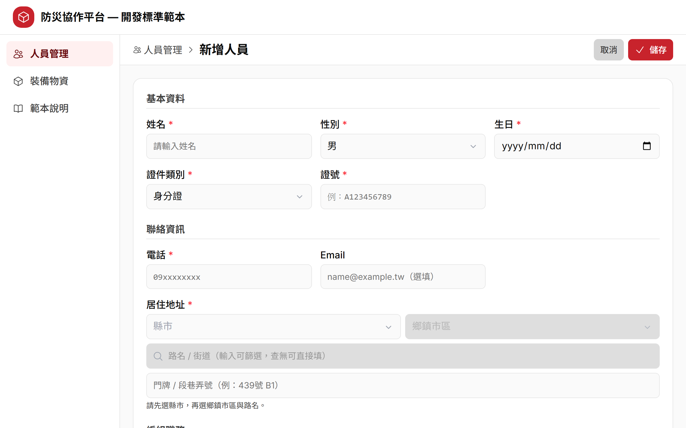
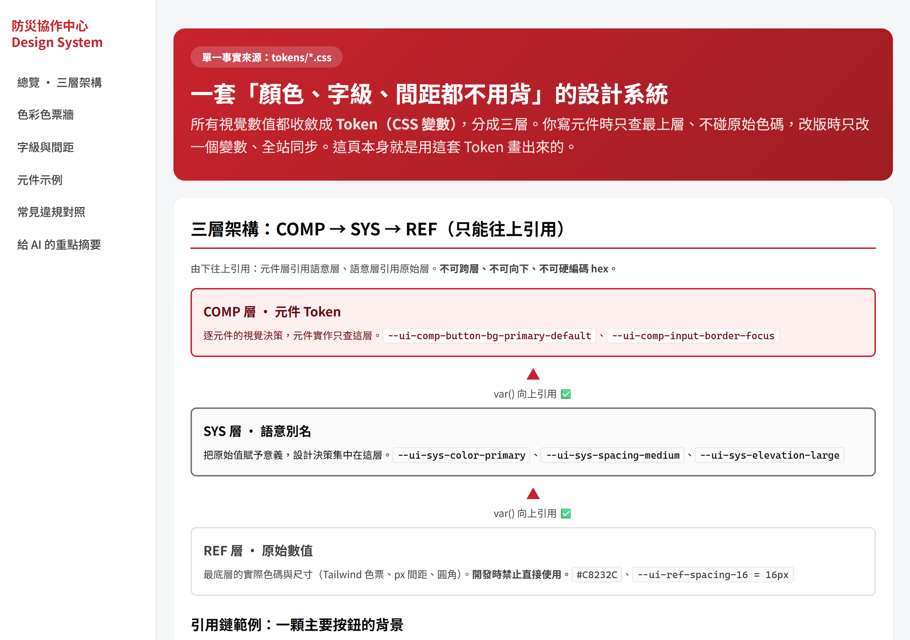
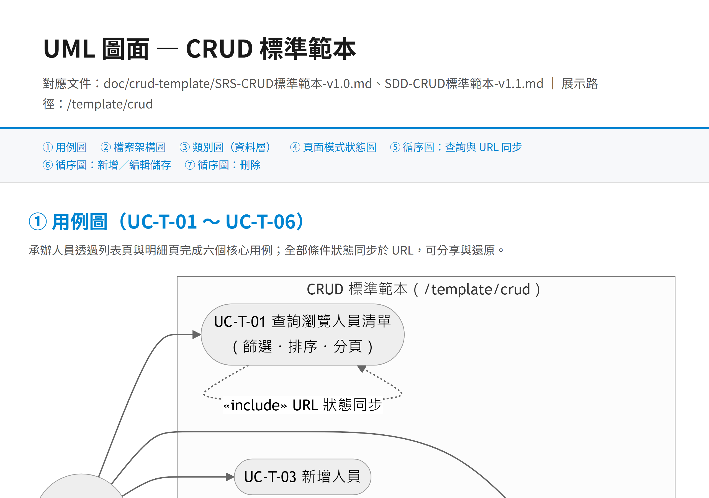
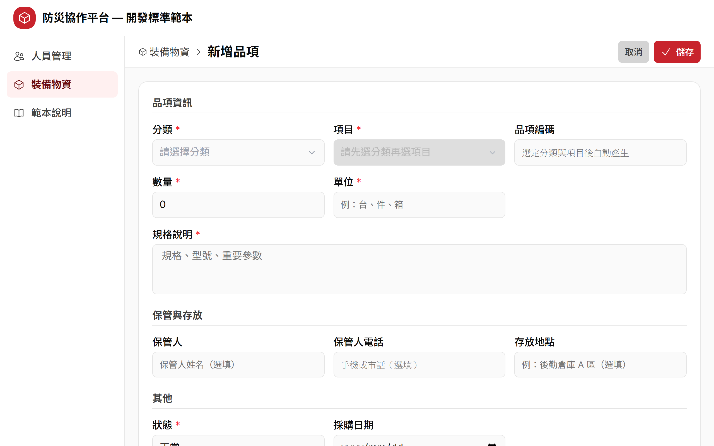
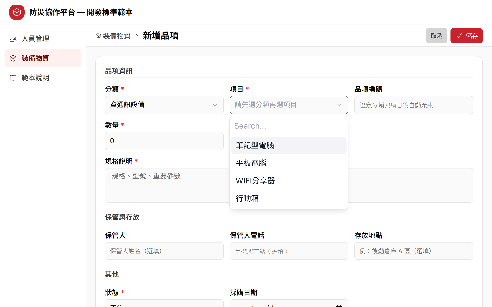
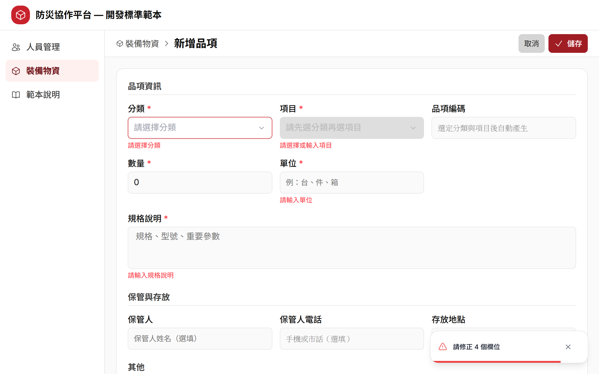
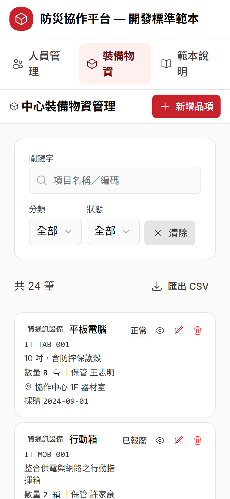

# AI CRUD 工作坊 EASY 版 — Step-by-Step 學習手冊

> **一句話**：用「範本 + harness + AI」把一個全新的 CRUD 模組，長出堪用骨架。課程目標：讓新 CRUD 模組的骨架在一小時內長出來（實測數據隨試教梯次更新）。
>
> 這份手冊帶你把整堂課從頭走一遍。每一步都有「要做到什麼、怎麼做、會看到什麼、為什麼」，課後照著走也能自己重現。

## 課程大綱

全程動手做，不是聽簡報。總時間約 **120 分鐘**，照順序走、不要跳步——後面會用到前面的產出。

| Step | 這一章在做什麼 | 時間 |
|------|--------------|:---:|
| step0 | 課程說明、前置檢查 | 10 分 |
| step1 | 為什麼要 harness（有／沒有 harness 產出對比） | 15 分 |
| step2 | CRUD 快速完工秘笈（玩範本 → 系統文件 → harness 四件 → Design System → 範本程式） | 40 分 |
| step3 | 複製範本開發新模組（PRD → AI 生成 → 反覆修正）**← 重頭戲** | 35 分 |
| step4 | LOOP 工程（改→驗→再改）＋ E2E 功能驗證＋失敗截圖診斷 ＋ 雙 AI 對抗審查 | 15 分 |
| step5 | 課程總結、回去怎麼用 | 5 分 |

**這門課給誰**：會寫程式、但還沒用過 AI harness 開發的工程師。不要求會 Vue／Nuxt，看得懂前端程式碼會更順。不需要提示詞經驗，課程會示範怎麼下指令。

**支援平台：Windows 與 macOS（Linux 亦可）。** 教材每支腳本都備了兩版——Windows 用 `.ps1`、macOS／Linux 用同名 `.sh`，檢查項目、判定標準與 exit code 完全一致。本手冊的指令一律分成兩塊列出，照你自己的平台那一塊做即可；`pnpm install`／`pnpm dev`／port 3100 這些跟平台無關。macOS／Linux 一律用 `bash 腳本名.sh` 執行，就不必先 `chmod +x`。

---

## Step 0｜課程說明與前置檢查

### 🎯 這一步要做到

1. 知道這門課要教什麼、怎麼進行。
2. 確認你的機器準備好了（Node.js、pnpm、git、port 3100、磁碟空間）。

### 👣 跟著做

1. 讀一遍 `step0_course_intro/START_HERE.md`，確認上完課你要帶走三件能力：看得出有無 harness 的差別、能用 AI 生成一個新模組、能設計並執行一輪 LOOP 驗證。
2. 每個 step 都有自己的資料夾與 `README.md`，照 step0 → step5 順序走。
3. 開課前先跑前置檢查：

   ```powershell
   # Windows（PowerShell）
   cd step0_course_intro
   .\preflight.ps1
   ```

   ```bash
   # macOS／Linux（終端機）
   cd step0_course_intro
   bash preflight.sh
   ```

4. 看到「前置檢查全數通過，可以開課！」再進 step1。若出現 `[FAIL]`，照腳本印出的修復提示處理後重跑一次。

### 👀 你應該看到

前置檢查腳本逐項印出 Node.js、pnpm、git、port 3100、磁碟空間的檢查結果，最後一行是「前置檢查全數通過，可以開課！」。

### 💡 為什麼

這堂課全程動手做，環境沒備好會卡在半路。前置檢查一次把常見坑（沒裝 pnpm、3100 埠被占用）攔在開課前，省得上課才發現跑不起來。

---

## Step 1｜為什麼要有 harness？

### 🎯 這一步要做到

1. 用「同一句需求、只差有沒有附規矩」的兩個產出，親眼看出差別。
2. 知道差別從哪來：規則（CODE-RULES）、範本、系統文件。

### 👣 跟著做

harness 就是你交給 AI 的一套「規矩」：**專案規則（CODE-RULES）＋設計系統（色票、間距）＋標準範本**。沒有它，AI 每次都在隨興發揮；有了它，產出從「路人硬湊」變成「像老手照團隊規矩寫的程式」。

1. 打開 `step1_why_harness/demo/PROMPT.md`，確認兩版給 AI 的需求**是同一句**，只差有沒有附規矩。
2. 雙擊 `demo/no-harness.html`（沒 harness 版）。
3. 雙擊 `demo/with-harness.html`（有 harness 版）。
4. 兩個視窗並排，逐項對照。兩版都真的能新增／刪除，功能一模一樣，差的是「品質」。

### 👀 你應該看到

左邊沒 harness＝藍色陽春頁，顏色亂配、中英夾雜、沒有驗證；右邊有 harness＝品牌紅 `#C8232C` 完整頁，必填標紅星、空白擋下、刪除跳二次確認。


*沒 harness：藍色系、`#0000ff` 硬編碼、`Add`／`刪除` 中英夾雜、按刪除直接刪。*


*有 harness：品牌紅、全繁中、必填加紅星、電話用 `PHONE_PATTERN` 驗證、刪除跳確認框。*

**逐項對照（差在哪、對應哪條規矩）：**

| 觀察點 | 沒 harness | 有 harness | 對應規則 |
|---|---|---|---|
| 顏色來源 | `#0000ff` 硬編碼散落各處 | 全走 `:root` 語意變數，色碼集中 | 禁止硬編碼 hex/px |
| 品牌一致性 | 藍色系，跟品牌無關 | 品牌紅 `#C8232C` 系 | 依功能類別選色 |
| 用字語言 | `Add`／`刪除` 中英夾雜 | 全繁中、中英之間加半形空格 | 一致語言 |
| 輸入驗證 | 空白也能新增 | 空白擋下、電話 `PHONE_PATTERN` | 純函式驗證＋具名常數 |
| 刪除操作 | 按下去直接刪 | 二次確認，鈕寫明「確認刪除」 | 危險操作二次確認 |
| 手機適配 | 窄螢幕表格擠爆 | `@media` 手機也能操作 | 響應式 |

### 💡 為什麼

把 harness 想成韁繩／馬具：**不是限制馬跑，是讓馬跑得直。** 馬（AI）的力氣一樣大，差別在有沒有方向。一句話結論：**同一句需求，差的不是 AI 智商，是你給不給規矩。**

---

## Step 2｜CRUD 快速完工秘笈

### 🎯 這一步要做到

1. 記住快速完工的公式：**範本給骨架、harness 給規矩、AI 出勞力。**
2. 把現成範本當使用者操作一輪，建立心智模型。
3. 認得前端 harness 四件、Design System、範本八個核心檔。

### 👣 跟著做

這一節分五個資料夾，照順序走：

| 資料夾 | 是什麼 | 在這裡做什麼 |
|---|---|---|
| `2.1_play_template` | 玩一輪範本 | 把現成範本當使用者操作一遍 |
| `2.2_docs` | 範本的 SRS / SDD | 需要時查規格 |
| `2.3_harness` | AI 的規矩四件 | 讀懂 AI 每次會遵守的鐵律 |
| `2.4_design_system` | Design System 與 token | 知道顏色／間距一律走 token |
| `2.5_sample_app` | 人員 CRUD 範例（範本正本） | 安裝啟動、對照 8 核心檔 |

1. 安裝並啟動範本：

   ```bash
   cd 2.5_sample_app/sample-app
   pnpm install      # 首次安裝依賴，順帶產生型別
   pnpm dev          # 啟動 dev server
   ```

2. 開瀏覽器到 <http://localhost:3100/template/crud>（開 `http://localhost:3100` 會自動導向）。
3. 逐一操作 CRUD 五個檢查點：新增一筆、進檢視頁編輯、刪除跳確認、關鍵字＋狀態篩選後複製網址開新分頁、匯出 CSV。
4. 加分：編輯時清空必填欄位按儲存（看紅字錯誤）、把視窗縮到手機寬度（看表格變卡片）。
5. 認識規矩：讀 `2.3_harness/CLAUDE.md`（專案憲法，AI 每次對話自動讀）與 `2.4_design_system`（顏色／間距一律走 token）。

### 👀 你應該看到

**範本列表頁**——桌機表格、關鍵字與狀態篩選、分頁、匯出 CSV 鈕、右上「新增人員」。


**範本新增表單**——Label 在上、必填加紅星、送出防重複。



**範本檢視頁**——單筆明細，可切到編輯。


**刪除二次確認框**——鈕寫「刪除人員」而不是空泛的「確認」，按下才刪。


**Design System 展示頁**——色票、間距、字級全部集中管理，AI 照這份配色不會亂來。



**UML 七圖**——這個模組的系統文件，把資料模型與流程畫清楚。



**CRUD 五個檢查點該看到什麼：**

| 操作 | 你應該看到 |
|---|---|
| 新增人員 → 儲存 | 成功 toast，列表出現新增那筆 |
| 進檢視頁 → 編輯 → 儲存 | 值更新，回列表反映變更 |
| 垃圾桶 → 二次確認 | 鈕寫「刪除人員」，按下才刪 |
| 打「陳」＋狀態篩選 → 複製網址開新分頁 | 表格即時過濾，新分頁完整還原篩選與排序 |
| 匯出 CSV | 下載的是**篩選＋排序後的全量**，非只當頁 |

### 💡 為什麼

**範本給骨架**：列表／明細／驗證／CSV／URL 同步／刪除確認全寫好了，複製改名即繼承。**harness 給規矩**：`CLAUDE.md` 是專案憲法，AI 每次對話自動讀，不會亂換套件、不硬編碼顏色。**AI 出勞力**：改欄位、改文案這種重複勞動交給 AI，你只負責決策與驗收。三者湊齊，一個全新 CRUD 模組半小時就能長出符合規範、可跑的骨架。

---

## Step 3｜複製範本開發新模組（重頭戲）

> **這一步你不寫程式，你當的是「提需求、做決策、驗成果」的人。** 寫程式的粗活是 AI 的事。

### 🎯 這一步要做到

1. 讀懂 PRD，理解「PRD 給全貌，不是這堂課的範圍」。
2. 把需求丟給 AI，讓它**先出選擇題釐清範圍**，你拍板。
3. 打開瀏覽器驗收與修正，重現列表、表單、驗證、刪除、手機五件事。

### 👣 跟著做

要長出的新模組是**中心裝備物資**（跑在 `/equipment/crud`），用的是跟 step2 同一套範本＋harness。

**⓪ 準備工作區（3.0）**

動手之前，先把範本複製成自己的工作專案，並確認 AI Agent 的工作目錄就是這個專案根目錄（不然 AI 讀不到題目文件與 harness）。

```powershell
# Windows（PowerShell）｜在工作坊根目錄執行：複製範本成你的工作專案
Copy-Item -Recurse step2_speedrun_kit\2.5_sample_app\sample-app step3_new_module\my-equipment-app
# 只把 PRD 放進專案（AI 才讀得到需求）
Copy-Item step3_new_module\PRD-中心裝備物資.md step3_new_module\my-equipment-app\
cd step3_new_module\my-equipment-app
pnpm install
# 在「這個資料夾」開 AI Agent（工作目錄＝專案根目錄）
```

```bash
# macOS／Linux（終端機）｜在工作坊根目錄執行：複製範本成你的工作專案
cp -R step2_speedrun_kit/2.5_sample_app/sample-app step3_new_module/my-equipment-app
# 只把 PRD 放進專案（AI 才讀得到需求）
cp step3_new_module/PRD-中心裝備物資.md step3_new_module/my-equipment-app/
cd step3_new_module/my-equipment-app
pnpm install
# 在「這個資料夾」開 AI Agent（工作目錄＝專案根目錄）
```

> **範圍答案由講師在你完成六題釐清後發放**（`instructor/SCOPE-課堂範圍決策.md`），先別偷看。這一步的重點就是你親自跟 AI 把範圍釐清出來，答案先進工作區等於直接抄，練習就沒了。

> harness 四件（`CLAUDE.md`、`CODE-RULES-ui-本專案.md`、`design-system-summary.md`、使用說明）已內建在專案根目錄，複製走範本就跟著走——AI 一進來就讀得到全套規則。

**① 讀 PRD（3.1）**

打開 `step3_new_module/PRD-中心裝備物資.md`。這份 PRD 是從真實災防平台現有頁面**逆向整理**出來的，記的是「現況」不是「理想」——連缺口都照實記（例如第 2.4 節白紙黑字寫「品項沒有刪除功能」）。標「原始碼未見／TODO」的地方＝待你決策。26 欄＋借用歸還＋維保提醒，兩小時做不完，很正常。

**② 貼起手 prompt，讓 AI 先問問題（3.2）**

用 **Agent 模式**跟 AI 對話（它需要能自己讀檔、改檔）。從 `PROMPTS.md` 複製【起手 prompt】整段貼上——這段同時交代「先讀 CLAUDE.md → CODE-RULES → 使用說明 → PRD、先別寫程式、要用選擇題問範圍」。

流程一句話記：**貼 prompt → AI 問 → 你答 → AI 列任務 → 你確認 → AI 逐項做並回報。**

```
你：貼【起手 prompt】
      ▼
AI：依序讀 CLAUDE.md → CODE-RULES → 使用說明 → PRD
      ▼
AI：先不寫程式，改用「選擇題」問你範圍（每題 2-4 選項＋建議）
      ▼
你：一題一題拍板（可直接採納建議）
      ▼
AI：輸出「任務清單」（8-10 個），停下等你確認
      ▼
你：說「開工」
      ▼
AI：逐任務開發、遵守 harness、每完成一個回報一行
```

**③ 一題一題拍板**

AI 會問六題，逐題拍板（可直接採納建議選項）：

| # | AI 會問 | 課堂拍板 |
|---|---|---|
| Q1 | 欄位做多少？ | 核心 **12 欄**（不是全部 26 欄） |
| Q2 | PRD 沒有刪除功能，怎麼辦？ | **補上硬刪除＋確認彈窗**（CRUD 要有 D） |
| Q3 | 借用／歸還、維保、照片、匯入 Excel？ | **全部範圍外** |
| Q4 | 匯出？ | **CSV 匯出**（範本現成工具，成本趨近零） |
| Q5 | 編碼規則？ | **簡化版**（不含機關前綴、不做同碼累加數量） |
| Q6 | 存放地點？ | **單一文字欄位**（不做級聯地址） |

> 六題不用背。重點是理解：**每題都是在「完整 PRD」和「兩小時課堂」之間做取捨，做取捨的人是你，不是 AI。**
> 如果 AI 沒問就直接開始寫程式，別讓它跑——貼 `PROMPTS.md` 的【釐清階段】救援 prompt 打斷它。

**④ 確認任務清單、說「開工」**

AI 會產出 8-10 個小到能單獨驗收的任務（T1 資料模型與 mock、T2 複製改名五檔、T3 列表頁、T4 表單頁、T5 連動下拉與編碼、T6 刪除、T7 CSV、T8 SRS/SDD、T9 自測）。順序合理就回「開工」；覺得少了什麼先補一句再放行。

**⑤ 驗收與修正（3.3）**

確認 dev server 在跑（port 3100），打開 <http://localhost:3100/equipment/crud>，拿講師發放的 `SCOPE-課堂範圍決策.md`（`instructor/SCOPE-課堂範圍決策.md`）欄位規格逐項對照。

### 👀 你應該看到

**AI 先出釐清選擇題**——它不急著寫程式，而是把岔路攤成選擇題，每題附建議。這代表 harness 在運作。


**裝備物資列表頁**——24 筆種子資料、預設每頁 20 筆、「分類→項目」升冪、顯示總筆數，狀態標籤正常＝綠、維修中＝黃、已報廢＝紅。


**新增表單**——含連動下拉與編碼預覽。選定分類＋項目後，標題即時顯示自動編碼。



**分類→項目連動下拉**——先選「分類」，「項目」才可選，且只出現該分類的項目。



**表單驗證**——空表單直接按儲存，跳出 4 欄紅字錯誤＋toast，且停在表單頁不離開。



**刪除品項確認框**——垃圾桶 → 二次確認彈窗 → 按「刪除」才真的刪。


**手機卡片檢視**——縮到手機寬度，表格自動變成卡片清單，資訊等價。



**驗收清單（至少要能重現）：**

| 驗收點 | 期望 |
|---|---|
| 列表 | 桌機表格、每頁 20 筆、「分類→項目」升冪、顯示總筆數 |
| 連動下拉 | 先選分類，項目才可選，只出現該分類項目 |
| 新增 | 選定分類＋項目後標題即時顯示編碼；必填未填仍可按儲存，會顯示欄位紅字並 toast 提示「請修正 N 個欄位」 |
| 刪除 | 垃圾桶 → 二次確認 → 才刪 |
| CSV 匯出 | 匯出全量（非當頁），含 BOM 中文不亂碼 |

**修正心法（三條）：**

| 心法 | 怎麼做 |
|---|---|
| 一次只修一個問題 | 一則訊息只提一件事，改完再看下一件 |
| 描述「看到什麼 vs 期望什麼」 | 「我看到日期是 2026/7/1，期望顯示成 2026-07-01」 |
| 兩次修不好就重新描述 | 換個說法重講一次，別繼續在同一串盧 |

### 💡 為什麼

PRD 有太多「做不做都行」的岔路。讓 AI 先用選擇題把岔路攤開、你拍板，範圍才會小而完整——這跟 spec-kit 的 clarify 是同一個道理：**先問對問題，再寫對程式。** 另外，那 24 筆 mock 資料的欄位名（`qty`、`unit`、`keeper`、`status`…）**就是未來接後端 API 的介面**，現在定好之後不再改，所以驗收時順手看一眼命名合不合理。卡住時 `solution-app/` 有參考解，但先自己做、真的卡兩次以上再看——直接抄答案學不到「怎麼提需求、怎麼驗收」，那才是這堂課的重點。

---

## Step 4｜LOOP 工程 × E2E 驗證

### 🎯 這一步要做到

1. 理解 LOOP 工程：**先給 AI 一個會給出紅/綠的自動驗證，再叫它自己修到綠。**
2. 跑一次 7 條 E2E 測試，看到全綠。
3. 記住兩條關鍵規則：兩次停損、修測試不修 App。

### 👣 跟著做

1. 先確認 solution-app 在跑（另一個視窗別關）：

   ```bash
   cd ../step3_new_module/solution-app
   pnpm dev          # http://localhost:3100（兩個平台指令相同）
   ```

2. 再跑 E2E：

   ```powershell
   # Windows（PowerShell）
   cd step4_loop_e2e
   powershell -ExecutionPolicy Bypass -File .\run-e2e.ps1
   ```

   ```bash
   # macOS／Linux（終端機）
   cd step4_loop_e2e
   bash run-e2e.sh
   ```

   腳本會：確認 3100 有回應且是本 App → 裝相依（已裝就跳過）→ 跑 7 條測試 → 印 PASS/FAIL 總結（exit 0＝全綠、1＝有紅）。

3. 要啟動 LOOP，一段話就夠（可直接貼；macOS／Linux 把腳本名改成 `run-e2e.sh`）：

   ```
   跑 step4_loop_e2e/run-e2e.ps1。
   若有紅字，找出原因、修正後再跑一次，直到 7 條全綠。
   規則：同一個問題連續修兩次還沒好就停下來回報（不要無限撞牆）。
   只准修測試，不准為了過測試去改 solution-app 的程式；
   若判斷是 App 真的有 bug，記下來回報，但不要動 App。
   ```

4. 動手經歷一次「紅 → 判因 → 修 → 綠」（LOOP 真正的重點，不是只看一次綠）：

   ```powershell
   # Windows（PowerShell）
   cd lab-red-to-green
   powershell -ExecutionPolicy Bypass -File .\inject-bug.ps1   # 讓 E4 變紅
   cd ..
   powershell -ExecutionPolicy Bypass -File .\run-e2e.ps1      # 看失敗訊息，判斷是 App bug 還是測試 bug
   cd lab-red-to-green
   powershell -ExecutionPolicy Bypass -File .\restore.ps1      # 修回（或自己把驗證規則加回去）
   cd ..
   powershell -ExecutionPolicy Bypass -File .\run-e2e.ps1      # 再跑一次，確認回到 7/7 綠
   ```

   ```bash
   # macOS／Linux（終端機）
   cd lab-red-to-green
   bash inject-bug.sh    # 讓 E4 變紅
   cd ..
   bash run-e2e.sh       # 看失敗訊息，判斷是 App bug 還是測試 bug
   cd lab-red-to-green
   bash restore.sh       # 修回（或自己把驗證規則加回去）
   cd ..
   bash run-e2e.sh       # 再跑一次，確認回到 7/7 綠
   ```

### 👀 你應該看到

E2E 腳本（`run-e2e.ps1`／`run-e2e.sh`）印出 7 條測試全數 `ok`，最後 `7 passed`、`EXITCODE=0`。


**七條測試各驗一個 CRUD 面向：**

| 編號 | 驗什麼 | CRUD 觀念 |
|---|---|---|
| E1 | `/equipment/crud` 看得到表格、「共 24 筆」 | Read |
| E2 | 輸入「發電機」縮到 2 筆、清除後恢復 24 筆 | Filter |
| E3 | new → 選分類→項目→編碼自動預覽 `PW-GEN-003` → 儲存 → 共 25 筆 | Create |
| E4 | new 直接儲存 → 出現「請選擇分類」且停在表單頁 | Validation |
| E5 | 刪除 → 確認框 → 取消不變、確認 -1 | Delete |
| E6 | `/template/crud` 正常載入 | Regression（沒改壞範本） |
| E7 | 編輯品項：改數量與存放地點，儲存後新值生效 | Update |

跑 `inject-bug`（`.ps1`／`.sh`）後再跑一次 E2E，會看到 **E4 變紅**（等不到「請選擇分類」錯誤訊息）；跑 `restore`（`.ps1`／`.sh`，或自己修回驗證規則）後再跑一次，7 條會**全部變回綠**。

### 💡 為什麼

**兩次停損規則**：AI 很會在同一個坑裡鬼打牆、愈修愈亂，兩次修不好＝方向錯了，該讓人看。**修測試不修 App**：LOOP 很會「為了讓燈變綠」而作弊（放寬斷言、改壞 App 邏輯），用這條把它框住。另外，寫測試的 AI 不適合審自己（它傾向相信自己寫對了），收尾要換第二個 AI（例如本機 Codex）用「盡力推翻它」的立場做對抗審查，找出假綠、猜的 selector、測試互相污染等問題，交回原 AI 修 → 再跑 → 再審，形成「對抗式 LOOP」。**LOOP 的核心是經歷紅到綠，不是看到綠**——只跑出一次全綠只證明現在沒壞，真正學到的是變紅之後怎麼判因、怎麼修。

> 這 7 條測試是**功能驗證＋失敗截圖診斷**（失敗時自動存一張截圖，給人也給 AI 判讀用），不是 pixel 比對的視覺回歸。**真正的視覺審查＝人逐張看截圖**（本手冊 16 張就是這樣審的），不是靠自動化斷言能取代的。

> **建置紀律補充**：這套測試第一次跑就全綠，靠的是「先 probe 探 DOM、再寫 selector」——探路的成本，遠低於用死站點瞎猜 selector 反覆跑紅的成本。細節見 `EVIDENCE-建置實錄.md`。

---

## Step 5｜課程總結與回去怎麼用

### 🎯 這一步要做到

1. 收攏四個 step 各帶走一個觀念。
2. 知道回公司落地的三個步驟。

### 👣 跟著做

**課程回顧：**

| Step | 帶走的觀念 |
|---|---|
| step1 | 同一句需求，有沒有附「規矩」（harness），產出天差地遠——差的不是功能，是像不像同一個團隊做的。 |
| step2 | 一個成熟模組＝範本（骨架）＋系統文件（SRS/SDD）＋harness 四件（規矩）＋Design System（視覺語言），缺一塊 AI 就會自由發揮出風險。 |
| step3 | 正確順序是 PRD → AI 提「釐清選擇題」→ 生成 SRS/SDD → 生成程式與假資料 → 人工反覆修正；AI 主動提問代表 harness 在運作。 |
| step4 | 可以讓 AI 自己跑「改→驗→再改」，但收尾一定要有人或另一個 AI 用 E2E 功能驗證＋失敗截圖診斷、對抗審查把關，不能只靠 AI 說「做完了」。 |

**回去怎麼用（三步驟）：**

1. **把前端 harness 四件帶進你的專案**——把 `CLAUDE.md`、`CODE-RULES-ui-本專案.md`、`design-system-summary.md`、使用說明（後端另有 harness 參考可比照）複製到你專案根目錄，內容改成你們公司的規則（色票、命名、驗證、禁止事項）。
2. **把既有標準頁面整理成範本**——挑一個最成熟的 CRUD 頁面，拆成「複製區」（跟實體有關的型別、欄位、驗證）與「共用區」（跟實體無關的通用邏輯）。
3. **新需求走完整流程**——PRD → 釐清選擇題 → SRS/SDD → 生成 → LOOP 驗證。拿到新需求先寫一頁 PRD（可以很簡陋），丟給 AI 配上 harness 與範本。

### 💡 為什麼

harness 方法**不綁框架**：不是 Nuxt 也適用，四件內容換成你們的技術棧規則即可，範本「複製 vs 共用」的心法在任何前端框架都通。沒有 Design System 也不用一次到位，先從色票與間距常數開始寫進 CODE-RULES，AI 就不會亂配色、亂用魔術數字。下一門後端課會用同一套流程，搭 `aspnet-api-ai-harness-v5` 做一個 .NET API CRUD 模組。

---

## 完課檢核表

全部打勾，代表你真的走完了：

- [ ] 前置檢查（`preflight.ps1`／`preflight.sh`）全數通過
- [ ] 並排看過 no-harness 與 with-harness 兩頁，說得出至少三個差別
- [ ] 範本人員 CRUD 在本機跑起來（port 3100），五個檢查點都重現
- [ ] 看過 Design System 與前端 harness 四件，知道顏色／間距走 token
- [ ] 讀懂 PRD，理解「PRD 給全貌，不是這堂課的範圍」
- [ ] 貼起手 prompt，AI 有先出釐清選擇題（不是直接寫程式）
- [ ] 六題範圍逐題拍板，確認任務清單後才說「開工」
- [ ] 裝備物資模組驗收：列表、連動下拉、新增編碼、刪除確認、手機卡片都重現
- [ ] E2E 腳本（`run-e2e.ps1`／`run-e2e.sh`）跑出 7 條全綠、exit 0
- [ ] 完成一次紅→判因→修→綠（留下四項證據）
- [ ] 說得出「兩次停損」與「修測試不修 App」兩條 LOOP 規則

## 回去怎麼用（三步驟速記）

1. **帶四件**：CLAUDE.md ＋ CODE-RULES ＋ design-system-summary ＋ 使用說明，複製進你的專案、改成公司規則。
2. **整範本**：挑最成熟的 CRUD 頁，拆「複製區 vs 共用區」。
3. **走流程**：PRD → 釐清選擇題 → SRS/SDD → 生成 → LOOP 驗證。
