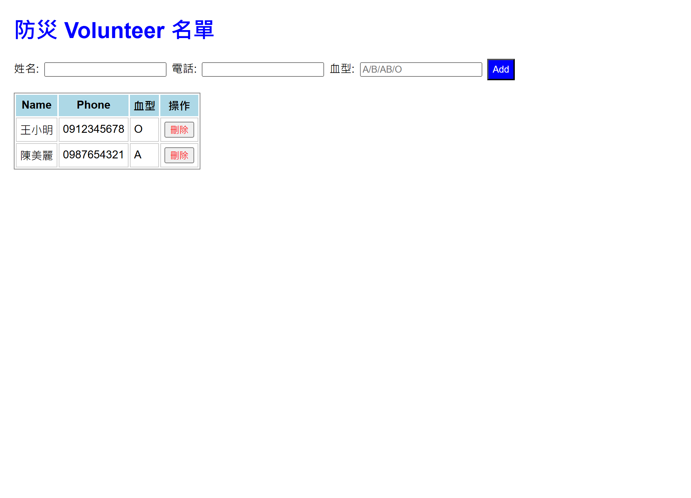
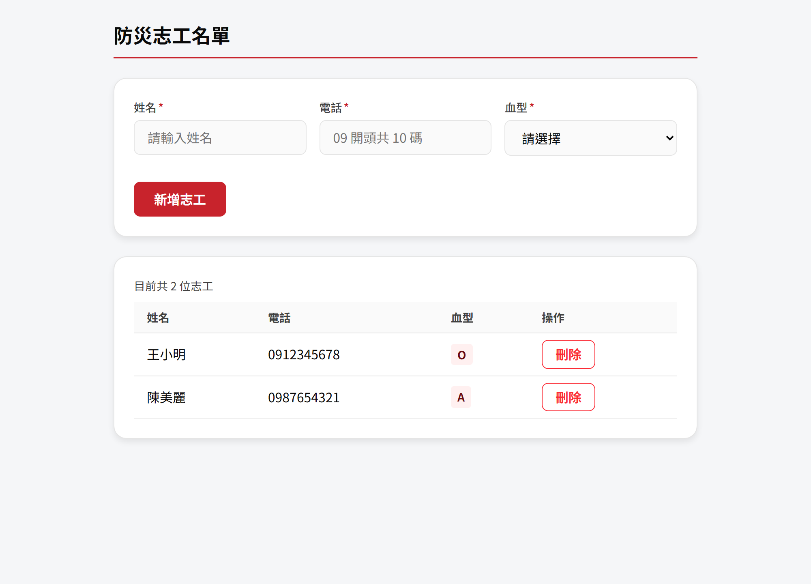

# Step 1｜為什麼要有 harness？

## harness 是什麼（三句話）

- harness 就是你交給 AI 的一套「規矩」：**專案規則**（CODE-RULES）＋**設計系統**（design token 色票、間距）＋**標準範本**。
- 沒有它，AI 每次都在「隨興發揮」，同一句需求今天做出來跟明天不一樣。
- 有了它，AI 產出從「路人硬湊」變成「像老手照團隊規矩寫的程式」。

> 把它想成韁繩／馬具：**不是限制馬跑，是讓馬跑得直。** 馬（AI）的力氣一樣大，差別在有沒有方向。

---

## 怎麼玩這個 demo

1. 打開 `demo/PROMPT.md` — 看清楚：兩版給 AI 的需求**同一句**，只差有沒有附規矩。
2. 雙擊 `demo/no-harness.html`（沒 harness 版）。
3. 雙擊 `demo/with-harness.html`（有 harness 版）。
4. 兩個視窗並排，照下面的對照表逐項比。兩版都真的能新增／刪除，功能一模一樣。

---

## 對照表：差在哪，對應哪條規矩

| # | 觀察點 | 沒 harness（no-harness.html） | 有 harness（with-harness.html） | 對應 CODE-RULES 條文 |
|---|---|---|---|---|
| 1 | 顏色來源 | 隨手 `#0000ff`、`lightblue`、`blue` 硬編碼散落各處 | 全部用 `:root` 語意變數（`--ui-sys-color-primary` 等），色碼集中一處 | 樣式：「**禁止**硬編碼 hex/px」、Token 別名用語意引用 |
| 2 | 品牌一致性 | 藍色系，跟防災紅品牌毫無關係 | 品牌紅 `#C8232C` 系，看得出是同一個系統 | 模組底色：依功能類別選色，本範本屬平時 |
| 3 | 用字語言 | 中英夾雜：`Add`／`刪除`、`Name`／`姓名`、標題 `Volunteer` | 全繁體中文：新增志工、姓名、電話、血型 | 註解／用字：一致語言；中英文之間加半形空格 |
| 4 | 必填標示 | 沒有任何必填提示 | Label 上方顯示、必填欄位加紅色 `*` | 表單互動：Label 在上、必填 `*` |
| 5 | 輸入驗證 | 空白也能新增、電話亂打也收 | 空白擋下、電話用 `PHONE_PATTERN`（09 開頭 10 碼）驗證 | 驗證：純函式驗證＋具名常數 `PHONE_PATTERN` |
| 6 | 錯誤呈現 | 無；頂多 `alert("新增 OK!")` 彈窗 | 紅字錯誤訊息顯示在**該欄位下方** | 表單互動：欄位級錯誤紅字 |
| 7 | 血型輸入 | 自由文字框，可打任何字 | 下拉選單固定 A／B／AB／O | 驗證：enum/狀態值嚴格依清單 |
| 8 | 刪除操作 | 按下去直接刪，不給反悔 | 跳二次確認框，確認鈕寫明「確認刪除」 | 表單互動：危險操作二次確認且確認鈕寫明動作 |
| 9 | 送出防呆 | 無，可連點重複新增 | 送出當下 `disabled` 防重複點擊 | 表單互動：送出防重複 |
| 10 | 間距與字級 | 隨意 `padding:5px`、`3px`，忽大忽小 | 統一走 4／8／16／24 間距與字級變數 | 樣式：禁止硬編碼 px，依 token 三層 |
| 11 | 手機適配 | 沒調校，窄螢幕表格擠爆 | `viewport` ＋ `@media`，手機也能讀能操作 | 響應式（NFR-T-05） |
| 12 | 程式品質 | 全域 `var`、inline `onclick`、魔術數字 | 具名常數、事件委派、無 `console.log`、無死碼 | 行數預算：無 magic literal、無 `console.log`、無死碼 |

---

## 一句話結論

**同一句需求，差的不是 AI 智商，是你給不給規矩。**
