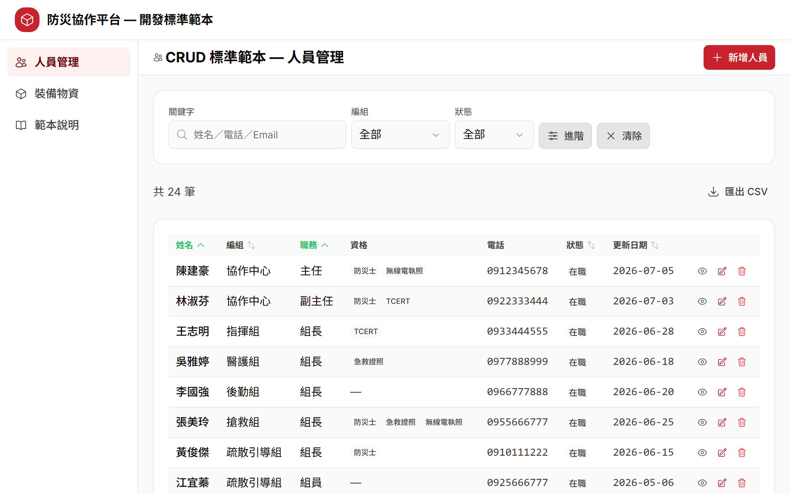
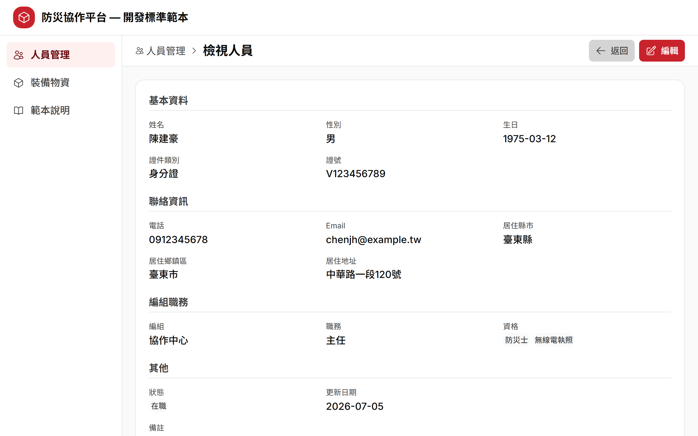
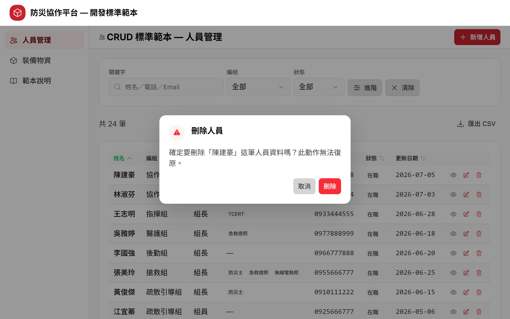

# 先玩一輪範本

> 動手複製之前，先把範本當使用者操作一遍，建立心智模型。
> 這些行為就是你之後複製出來的新模組會「免費繼承」的能力。

## 步驟一：複製範本

本課直接用 `2.5_sample_app` 的現成範本，**不必自己複製**。回公司開新模組時，複製流程見同資料夾的 `使用說明-複製範本開發新模組.md`。

## 步驟二：安裝並啟動

```bash
cd 2.5_sample_app/sample-app
pnpm install      # 首次安裝依賴（順帶產生型別）
pnpm dev          # 啟動 dev server
```

啟動後開瀏覽器到 <http://localhost:3100/template/crud>（開 `http://localhost:3100` 會自動導向）。



## 步驟三：操作 CRUD 五個檢查點

逐一操作，每個檢查點確認「你應該看到什麼」。

| # | 操作 | 你應該看到什麼 |
|---|---|---|
| 1 | 點右上「新增人員」→ 填欄位 → 儲存 | 成功 toast，回列表看到新增那筆 |
| 2 | 點某一列進檢視頁 → 「編輯」→ 改欄位 → 儲存 | 值更新、回列表反映變更 |
| 3 | 點某列垃圾桶 → 二次確認框 | 跳出確認框，鈕寫「刪除人員」而非「確認」；按下才刪 |
| 4 | 關鍵字打「陳」＋選狀態篩選 → 複製網址開新分頁 | 表格即時過濾；網址帶 `?...`，新分頁完整還原篩選與排序 |
| 5 | 點右上「匯出 CSV」 | 下載 CSV，內容是**篩選＋排序後的全量**（非只當頁） |



## 加分：驗證與響應式

- 編輯時清空必填欄位按儲存 → 欄位下方**紅字錯誤**、自動聚焦第一個錯誤欄（不是只有 toast）。
- 把視窗縮到手機寬度（< 768px）→ 表格變成卡片清單，資訊等價。



## 檢查點總結

以上五個檢查點都能重現，就代表範本在你機器上跑起來了。這五個行為（加上驗證與響應式）就是新模組會自動繼承的骨架。

> 完整的「複製範本開發新模組」工作流程，見同資料夾的 `使用說明-複製範本開發新模組.md`（362 行完整版）。
