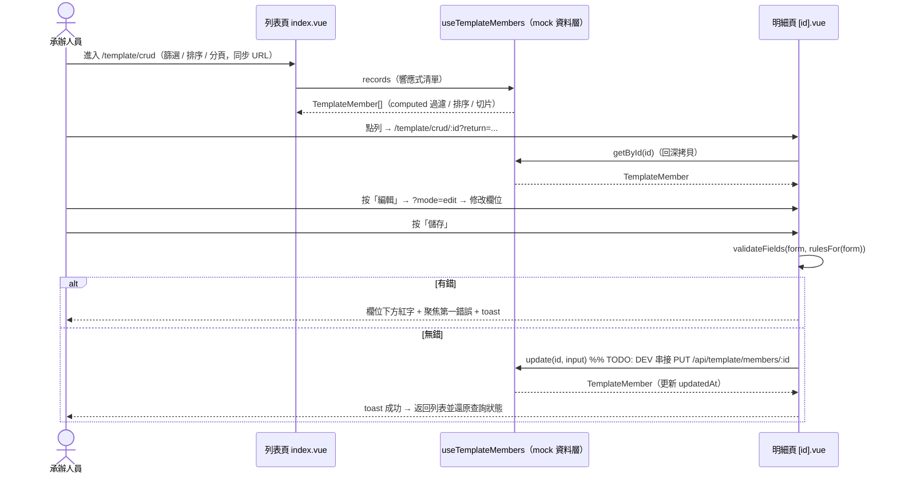
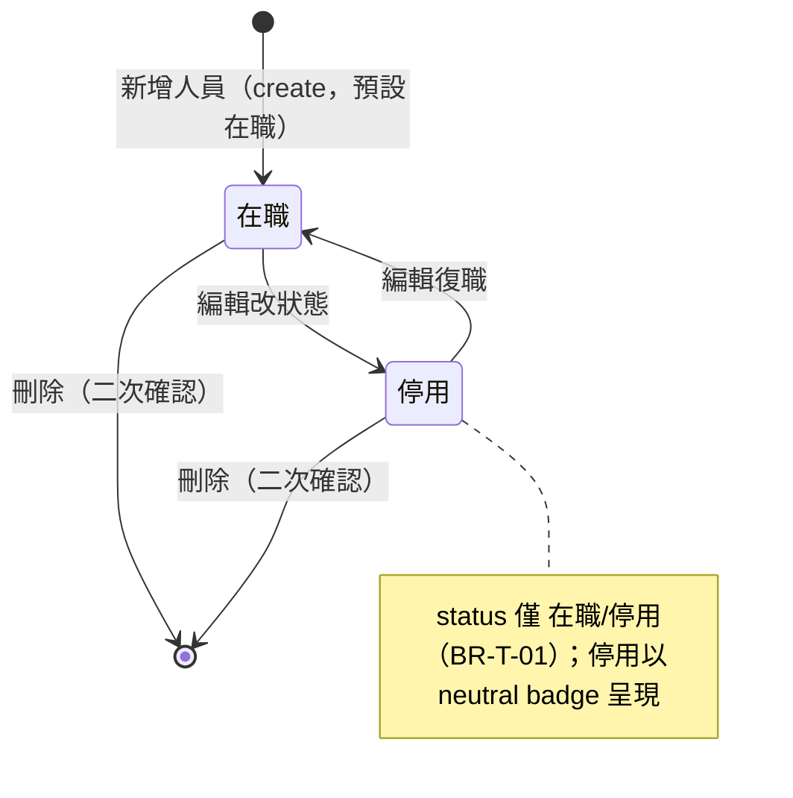

# SPEC — 人員 CRUD（教學示範）

> 用途：把「CRUD 標準範本」的人員 CRUD 填成一份**完整示範規格**（教學用「填好的考卷」，非最小雛形）。回公司要交規格文件時，可以照這份的章節骨架寫。
> 本檔已**併入原 `SRS-CRUD標準範本-v1.0`**（目的與定位、示範實體、Use Cases、FR-T／BR-T／NFR-T、範圍外、驗收清單），
> 所以規格只需要看這一份；**設計與實作細節**見同資料夾 `SDD-CRUD標準範本-v1.1.md`，架構圖見 `DIAGRAMS.html`。
> 說明：本專案目前**無後端**，故 Mode 選 **UI**（前端雛形，資料綁 mock）。純 UI 雛形其實只需填 Feature 與 CRUD UI Spec 兩節；此處為教學完整性補齊 FR/BR/圖/Mock/Done，並在 API 相關節標交接記號。

Mode: `UI`（雛形：資料綁 mock，API 串接點標 `// TODO: DEV 串接`）

## 文件資訊

| 項目 | 內容 |
|------|------|
| 文件版本 | SPEC v1.1（2026-08-19 併入 SRS-CRUD標準範本 v1.0） |
| 狀態 | 已核准（供 SDD／實作使用） |
| 範圍 | 前端 ＋ UIUX（本專案尚無後端；資料層預留後端接軌接縫） |
| 示範資料來源 | 人力暨輪值編排（`/township/hr/team?view=roster`）之簡化人員名冊 |

## 編號與交接標記

- 沿用原 SRS 的 `FR-T-*`（功能）、`BR-T-*`（商業規則）、`NFR-T-*`（非功能）編號（已併入本檔）；本 SPEC 補 `TC-T-*` 測試案例。
- 標記：`[SA 確認]` 業務待確認、`[SD 待定]` 技術待定、`[DEV 實作]` 留給實作、`[待實機]` 需真實環境量測。

## 目的與定位

本模組**不是業務功能**，而是一份「可執行的開發標準」：

1. **教育訓練教材**：新進人員透過一個完整、乾淨、可跑的 CRUD 範例，學會本專案的標準做法。
2. **新模組開發起點**：開發新 CRUD 模組時，複製本範本改名即可獲得符合規範的骨架。
3. **重構對照組**：與現行 roster 頁（單檔 2,255 行、三頁重複邏輯）對照，示範 Clean Code / Refactoring 原則的實際效益。

### 設計原則（約束所有 FR）

- **簡化**：示範實體僅保留具教學代表性的欄位型態（文字、enum、日期、陣列、巢狀地址、狀態）。
- **一致**：排序、分頁、確認對話框等一律採用專案內「最成熟的一種做法」，消除現況多套並存。
- **可複製**：所有範本檔案以 `Template` / `template` 命名空間隔離，複製改名即成新模組。
- **後端就緒**：資料層 API 一律非同步（Promise），未來以 `useFetch` 替換內部實作即可，呼叫端不變。

### 示範實體：人員（TemplateMember）

自 roster 的 `RosterRecord`（約 40 欄）精簡為 **17 欄**，欄位命名與 roster 對齊以利日後整合。逐欄型別、必填、UI 元件與驗證規則見下方 **CRUD UI Spec → Fields**。

種子資料：**24 筆可讀的字面量資料**（非 hash 產生器），涵蓋所有編組、職務、狀態組合；分頁預設 10 筆／頁時恰有 3 頁。

## Feature

Name: `CRUD 標準範本 — 人員管理（TemplateMember）`

Goal: 提供一個完整、乾淨、可跑的前端 CRUD 範例（查詢 / 檢視 / 新增 / 編輯 / 刪除 / 匯出），作為新進教材、新模組起點與 Clean Code 對照組。資料層全非同步（Promise），預留後端接軌接縫，呼叫端不變。

## Diagrams（圖優先於長文字）

### 主要流程：查詢 → 檢視 → 編輯 → 儲存（UI Mode，資料層為前端 mock）

### 人員狀態生命週期

## Use Cases

| ID | 名稱 | 主要流程摘要 |
|----|------|------|
| UC-T-01 | 查詢瀏覽人員清單 | 進入列表 → 關鍵字/條件篩選 → 排序 → 分頁瀏覽；條件同步於 URL，可分享/重整還原 |
| UC-T-02 | 檢視人員明細 | 列表點列 → 整頁檢視（唯讀）→ 返回列表（還原查詢狀態） |
| UC-T-03 | 新增人員 | 列表按「新增」→ 整頁表單 → 欄位級驗證 → 儲存 → 返回列表並提示成功 |
| UC-T-04 | 編輯人員 | 檢視頁或列表按「編輯」→ 表單載入既有值 → 驗證 → 儲存 → 返回 |
| UC-T-05 | 刪除人員 | 列表操作「刪除」→ 二次確認對話框 → 刪除 → 提示成功 |
| UC-T-06 | 匯出 CSV | 列表按「匯出」→ 下載目前篩選+排序結果之 CSV（UTF-8 BOM） |

## Functional Requirements

FR-T 需求以 Given / When / Then 表述；優先級用 MoSCoW。

| ID | Given / When / Then | 優先級 |
|---|---|---|
| FR-T-101 | Given 在人員列表 / When 輸入關鍵字或選編組、狀態 / Then 即時比對姓名、電話、Email 過濾 | Must |
| FR-T-102 | Given 展開進階篩選 / When 選資格、居住縣市→鄉鎮區（相依下拉）/ Then 套用過濾，且折疊鈕顯示已啟用進階條件數徽章（僅計 qual/county/township）| Should |
| FR-T-103 | Given 已套用任意條件 / When 按「清除」/ Then 重設所有條件並回到第 1 頁 | Must |
| FR-T-104 | Given 前端記憶體資料 / When 任一條件變更 / Then 即時過濾且頁碼重設為 1 | Must |
| FR-T-105 | Given 過濾後無符合資料 / When 呈現結果 / Then 顯示空狀態（圖示＋說明），不顯示空表格 | Must |
| FR-T-201 | Given 列表表頭 / When 點可排序欄（姓名/編組/職務/狀態/更新日期）/ Then 單欄排序，再點切換升降 | Must |
| FR-T-202 | Given 進入列表未點表頭 / When 顯示預設順序 / Then 職務權重升冪（主任在前）→ 姓名 | Must |
| FR-T-203 | Given 列表分頁 / When 切換每頁筆數（10/20/50/100）/ Then 顯示「第 x 至 y 項，共 n 筆」，預設 10 | Must |
| FR-T-301 | Given 路由 `/template/crud/[id]` / When id=`new` / `?mode=edit` / 其餘 / Then 對應 新增 / 編輯 / 檢視 三合一 | Must |
| FR-T-302 | Given 表單 / When 顯示 / Then 依區塊分組：基本資料、聯絡資訊、編組職務、其他 | Should |
| FR-T-303 | Given 儲存時欄位驗證未過 / When 送出 / Then 錯誤訊息顯示於欄位下方紅字並聚焦第一個錯誤欄位，不得只用 toast | Must |
| FR-T-304 | Given 明細頁主要動作（儲存/取消/編輯/返回）/ When 渲染 / Then 一律 Teleport 至 `#breadcrumb-actions`（返回用 `-left`），內容區不重複渲染 | Must |
| FR-T-305 | Given 編輯/新增 / When 儲存成功 / Then toast 提示 → 返回列表並還原查詢狀態；取消 → 直接返回不儲存 | Must |
| FR-T-401 | Given 列表列操作區 / When 點「刪除」/ Then 開啟 `AppConfirmModal`（danger），內文含人員姓名 | Must |
| FR-T-402 | Given 刪除致當頁變空 / When 確認刪除 / Then toast 提示並自動退回前一頁 | Should |
| FR-T-501 | Given 目前篩選＋排序後的完整結果 / When 按「匯出 CSV」/ Then 下載全量（非僅當頁）CSV，含 UTF-8 BOM、檔名含日期 | Should |
| FR-T-601 | Given 篩選/排序/頁碼/每頁筆數變更 / When debounce 300ms 後 / Then 僅非預設值寫入 URL query，重整/分享可還原 | Must |
| FR-T-602 | Given 前往明細頁 / When 導覽 / Then 攜帶 `return` query 保存列表狀態，返回時還原 | Must |

## Non-Functional Requirements

| ID | 需求 |
|---|---|
| NFR-T-01 | **RWD**：`md`（768px）以上顯示表格，以下顯示卡片清單；兩者資訊等價。 |
| NFR-T-02 | **無障礙**：互動元件皆有 focus-visible ring；icon 按鈕有 aria-label；錯誤訊息以 `aria-describedby` 關聯欄位。 |
| NFR-T-03 | **視覺**：全面使用 design token（COMP→SYS→REF），禁止硬編碼色值；模組屬「平時」類別 → 白／淡色底。 |
| NFR-T-04 | **程式品質**：單檔 ≤ 500 行（`[id].vue` 例外上限 550）；無 magic literal（抽為具名常數）；無 console.log 殘留；無死碼。 |
| NFR-T-05 | **效能**：衍生資料一律 `computed`；列表渲染不得在 template 內執行 O(n) 掃描函式。 |

## Business Rules

| ID | 規則 | 影響範圍 |
|---|---|---|
| BR-T-01 | 必填見 Fields 表；Email 選填，填了必須合法 | 驗證 |
| BR-T-02 | 證號依 idType：身分證 `^[A-Z][12]\d{8}$`；居留證/護照僅檢查非空與長度上限 | nationalId 驗證 |
| BR-T-03 | 行動電話 `^09\d{8}$` | phone 驗證 |
| BR-T-04 | 刪除須二次確認，確認文案含該筆識別資訊（姓名） | 刪除流程 |
| BR-T-05 | positionTitle 由 positionCode 導出，不可獨立編輯 | 表單/顯示 |
| BR-T-06 | updatedAt 由系統於新增/編輯時寫入（本地時區），表單不可編輯 | 稽核欄位 |

## 範圍外（本版不做）

- 後端 API 串接（資料層已預留接縫，見同資料夾 `SDD-CRUD標準範本-v1.1.md`）
- 批次操作、拖曳指派、雙 Tab 視圖（roster 的編組架構功能屬業務特化，不屬標準範本）
- 匯入 CSV、照片上傳、權限控制
- 自動化測試框架導入（列為後續建議）

## API Contract

`[SD 待定] 後端尚未建置`。本版為前端 UI 雛形，資料層以 `useTemplateMembers`（前端 mock、module-level ref 單例）實作，全函式回 Promise，接縫已預留：未來以 `useFetch('/api/template/members'...)` 替換內部實作，呼叫端不變。

同資料夾 SDD §2.3 預留之 RESTful 端點草案（`[SD 待定]`，供後端接軌時定案）：

| 對應資料層函式 | Method | Path | 說明 |
|---|---|---|---|
| records / 列表 | GET | `/api/template/members` | 查詢（未來含 query 參數）|
| getById | GET | `/api/template/members/{id}` | 單筆 |
| create | POST | `/api/template/members` | 新增，回傳含系統產生 id / updatedAt |
| update | PUT | `/api/template/members/{id}` | 覆寫，更新 updatedAt |
| remove | DELETE | `/api/template/members/{id}` | 刪除 |

Response envelope、驗證錯誤碼、權限中介層 → `[SD 待定]`（後端建置時依專案既有 `ApiResponse<T>` 格式定案）。

## Data / DB

`[SD 待定]`：本版無 DB。實體 `TemplateMember`（17 欄，見 Fields）暫存於前端 mock 資料層。未來資料表命名、審計欄位、migration 留待後端 SDD。

| Name | Notes |
|---|---|
| TemplateMember | 17 欄；id `M-001` 流水號；種子 24 筆字面量測試資料 |

## Mock Data Required

一律標示為測試資料（誠實原則：不拿假資料冒充真實資料），已於 `useTemplateMembers.ts` 檔頭註明「虛構測試資料」。24 筆字面量（非 hash 產生器），涵蓋：

- normal：全部 6 編組、4 職務（主任/副主任各 1 隸屬協作中心）。
- boundary：至少 3 筆「停用」、至少 8 筆含 1~3 個資格；updatedAt 分佈 2026-05~2026-07 供排序示範；分頁預設 10 筆恰 3 頁。
- validation error（表單層）：電話非 09 開頭、身分證格式錯、Email 格式錯、必填留空。
- empty：篩選出空集合 → 空狀態。
- permission denied：`[SA 確認]`（本版無權限控制，見下方 Permissions）。

## TDD Cases

`[待實機/DEV 實作]`：本檔「範圍外」明列自動化測試框架導入為範圍外，本版以人工目視 + Token Check 驗收。下列為建議案例（對應 FR，供未來導入單元測試時填實）：

| TC | 對應 FR | Given / When / Then | 類型 |
|---|---|---|---|
| TC-T-01 | FR-T-101/104 | 輸入關鍵字 → 清單即時過濾且 page=1 | happy path |
| TC-T-02 | FR-T-105 | 條件無符合 → 顯示空狀態非空表格 | empty result |
| TC-T-03 | FR-T-303/BR-T-02/03 | 電話/證號/Email 格式錯 → 欄位下方紅字 + 聚焦第一錯 | validation |
| TC-T-04 | FR-T-202 | 未點表頭 → 職務權重→姓名排序 | boundary |
| TC-T-05 | FR-T-402 | 刪光當頁最後一筆 → 自動退前一頁 | boundary |
| TC-T-06 | FR-T-601/602 | 帶條件重整 / 明細返回 → 狀態還原 | regression |

## CRUD UI Spec

Frontend: `Vue 3 + Nuxt 3`（Nuxt UI v2 + Tailwind + Design Token 三層架構）；`<script setup lang="ts">`。

Existing CRUD example（路徑相對 `sample-app/`）：`pages/template/crud/`（`index.vue` 列表、`[id].vue` 檢視/編輯/新增三合一）；資料層 `composables/useTemplateMembers.ts`、列表狀態工廠 `composables/useTemplateListPage.ts`；util `utils/templateValidation.ts`、`utils/templateCsv.ts`；元件 `components/template/TemplateFormField.vue`、`TemplateStatusBadge.vue`。

Design System summary: `sample-app/design-system-summary.md`（token 實檔與完整手冊見 `../2.2_design_system/`）。

Page sections:

- Search Area：`CardOutlined` 內，第一列 關鍵字 `UInput` + 編組/狀態 `USelectMenu` + 進階 toggle（含 advancedActiveCount 徽章）+ 清除；進階列 資格 `USelectMenu` + 居住縣市/鄉鎮相依下拉（`'全部'` 哨兵）。
- Toolbar：左側結果筆數；右側「匯出 CSV」`UButton`（secondary）。
- Data Table：桌機語意 `<table>`（`hidden md:block`），欄 姓名/編組/職務/資格(badge +N)/電話/狀態(`TemplateStatusBadge`)/更新日期/操作；`AppSortHeader` + `useTableSort`；斑馬紋。手機（`md:hidden`）改卡片，資訊等價，操作鈕 `@click.stop`。
- Pagination：`AppTableFooter`，canonical props `:current-page` `:total-items` `:page-size`。
- Create / Edit Form：分組（基本/聯絡/編組職務/其他），`TemplateFormField` 包輸入元件。
- Delete Confirm：`AppConfirmModal`（danger、title「刪除人員」、message 含姓名）；confirm 後自行關閉。
- Toast / Alert：`useToast()`，成功綠/錯誤紅。

Fields（17 欄，對照上方「示範實體」＋同資料夾 SDD §7.2）：

| Field | Type | Required | UI Component | Validation | Notes |
|---|---|---:|---|---|---|
| id | string | 系統 | —（不可編輯） | — | 主鍵 `M-001`，create 由系統產生 |
| name | string | yes | UInput | required | 一般文字 |
| gender | enum 男/女 | yes | USelectMenu | required | 生產頁無 URadioGroup 先例，故用 select |
| birthDate | date | yes | AppDatePicker | required | v-model `YYYY-MM-DD` 字串 |
| idType | enum 身分證/居留證/護照 | yes | USelectMenu | required | 影響 nationalId 規則（相依 enum）|
| nationalId | string | yes | UInput | required + 依 idType：TW_ID_PATTERN / 非空+長度上限 | BR-T-02 |
| phone | string | yes | UInput | required + PHONE_PATTERN | BR-T-03 |
| email | string | no | UInput | 選填，填了須 EMAIL_PATTERN | BR-T-01 |
| residenceCounty / residenceTownship | string | yes | AppAddressPicker（county/township，相依）| required | 縣市→鄉鎮相依下拉 |
| residenceAddress | string | yes | AppAddressPicker（detail）| required | 詳細地址 |
| groupName | string | yes | USelectMenu | required | TEMPLATE_GROUP_OPTIONS（6 編組）|
| positionCode | enum director/deputy/leader/member | yes | USelectMenu | required | 含排序權重 |
| positionTitle | string | 系統 | —（唯讀導出）| — | BR-T-05 由 code 導出 |
| qualifications | string[] | no | UCheckbox 橫向群組 | — | 4 選項多值 |
| status | enum 在職/停用 | yes | USelectMenu | required | TemplateStatusBadge 顯示 |
| note | string | no | UTextarea | — | 長文字 |
| updatedAt | date | 系統 | —（唯讀）| — | BR-T-06 系統本地時區寫入 |

Permissions:

| Action | Role | Rule |
|---|---|---|
| Create | `[SA 確認]` | 本版無權限控制（見「範圍外」）；未來角色與規則待 SA 確認 |
| Edit | `[SA 確認]` | 同上 |
| Delete | `[SA 確認]` | 同上；刪除仍須二次確認（BR-T-04）|

## Assumptions

- 無後端：資料層為前端 mock，全非同步以預留接縫（見「設計原則」的「後端就緒」）。驗證方式：`useTemplateMembers.ts` 函式簽章與 SDD §2.3 一致。
- 無權限控制與自動化測試（見「範圍外」）。驗證方式：本檔「範圍外」章節明列。
- 模組屬「平時」類別 → 白/淡色底，不做災時/演練樣式。驗證方式：`design-token.css` 模組底色規則。

## Done Criteria

本 UI 雛形的完工條件如下（依實況調整）：

- 驗收清單逐條成立（UC-T-01~06 全流程可操作、每個 FR／BR 逐條檢核、桌機 1280px 與手機 390px 視覺檢查、URL 帶條件重整後狀態一致、`sample-app/CLAUDE.md` 禁止事項清單逐條比對）。
- CRUD UI Spec 完整、Fields 已 mapping Design System 元件。
- Token 檢查通過（或只剩已列明的既有技術債手動項）。
- 前端驗證規則（`validateFields` + pattern）、資料層接縫註解已定義。
- API / DB / TDD / 權限節之交接記號（`[SD 待定]`/`[SA 確認]`/`[待實機]`）保留待後端建置與 SA 確認——**不得以假資料冒充完成**（誠實原則）。
- Review Gate（審寫分離、另開對話）通過、無 ❌。
- 因「範圍外」排除自動化測試，L1/L2/L3 於本版不適用；驗證以 Token Check + 人工目視為主。
