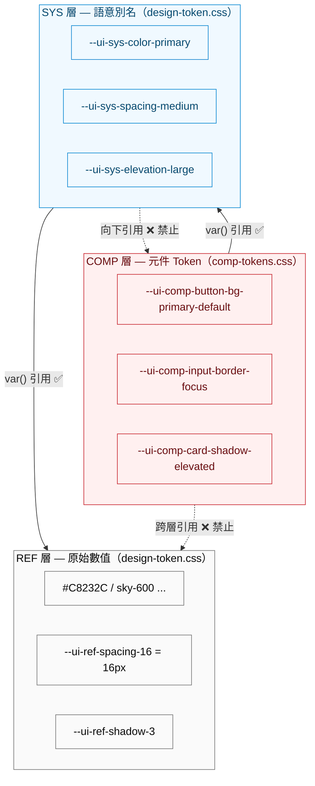
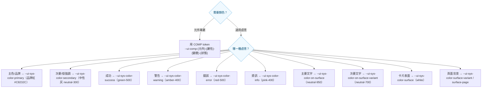
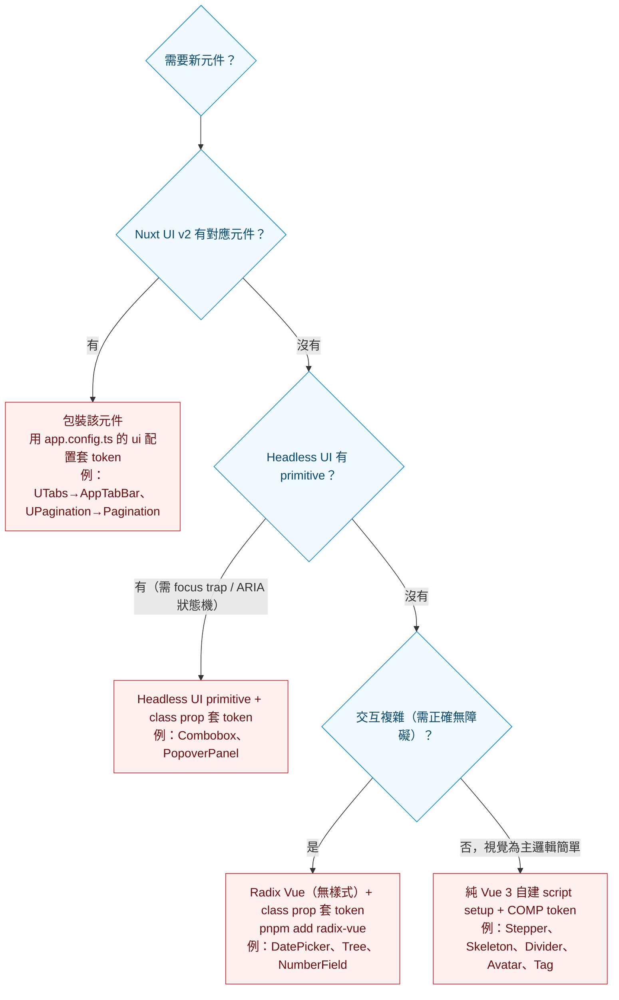

# 防災協作中心 Design System 教學手冊

> 對象：導入本設計系統的前端工程師、UI/UX 設計師、新進訓練學員。
> 目標：讀完能理解三層 Token 架構、正確引用色彩與字體、依規範開發元件、避開常見地雷。
>
> **本手冊的數值以 `tokens/design-token.css` 與 `tokens/comp-tokens.css` 的實際內容為準**（那是新專案實際會載入、實際會渲染的檔案）。原專案的 `frontend/CLAUDE.md` 與 `design-system-guideline.md` 有多處已落後於 CSS 實作，衝突處本手冊一律採「以 CSS 實檔 + CLAUDE.md 規範精神」為準，並在 [第 9 章 已知不一致](#9-已知不一致與資料落差) 逐條列出。

---

## 目錄

1. [三層 Token 架構（REF → SYS → COMP）](#1-三層-token-架構ref--sys--comp)
2. [色彩系統](#2-色彩系統)
3. [字體系統](#3-字體系統)
4. [間距、圓角、陰影](#4-間距圓角陰影)
5. [元件規範精華](#5-元件規範精華)
6. [新元件開發決策樹](#6-新元件開發決策樹)
7. [無障礙要求清單](#7-無障礙要求清單)
8. [常見錯誤與反例](#8-常見錯誤與反例)
9. [已知不一致與資料落差](#9-已知不一致與資料落差)

---

## 1. 三層 Token 架構（REF → SYS → COMP）

設計系統的所有視覺數值都以 **CSS Custom Properties** 實作，分三層。**引用只能由下往上（COMP → SYS → REF），不可跨層、不可向下、不可硬編碼。**



### 每一層在做什麼

| 層 | 檔案 | 命名 | 角色 | 開發者能不能直接用？ |
|----|------|------|------|--------------------|
| **REF** | `design-token.css` | `--ui-ref-{類別}-{階}` | 原始數值：Tailwind 色票 50–950、px 間距、字級、圓角、陰影 | ❌ **禁止**在元件或 template 直接用 |
| **SYS** | `design-token.css` | `--ui-sys-{類別}-{角色}` | 語意決策：把 REF 賦予意義（primary / success / on-surface / spacing-medium） | ✅ 可用（沒有對應 COMP token 時） |
| **COMP** | `comp-tokens.css` | `--ui-comp-{元件}-{屬性}-{變體}-{狀態}` | 元件的隔離視覺介面，封裝所有決策 | ✅ 元件實作**優先**用這層 |

### 引用鏈範例（一顆主要按鈕的背景色）

```
元件 class:  bg-[var(--ui-comp-button-bg-primary-default)]
   ↓ COMP
--ui-comp-button-bg-primary-default:  var(--ui-sys-color-primary)
   ↓ SYS
--ui-sys-color-primary:  #C8232C   ← 品牌紅（此處直接是 hex，見第 9 章說明）
```

### 引用規則（務必背下來）

```
✅ COMP  →  SYS  →  REF        正確方向
❌ COMP  →  REF                 禁止跨層（跳過 SYS）
❌ COMP  →  硬編碼 hex/px        禁止硬編碼
❌ SYS   →  COMP                禁止向下引用
```

### 顏色決策樹：我需要一個顏色時該用哪個 token？



> ⚠️ **次要色 secondary 是中性灰（neutral-300），不是彩色。** 這是刻意的設計決策：讓視覺層級清楚（primary 高強調 → secondary 低強調 → ghost 最低），並避免次要按鈕與功能色（success/warning/error）搶色。

---

## 2. 色彩系統

### 2.1 主要 SYS 色彩語意表

下表為 `design-token.css` 的**實際 SYS 值**（新專案載入後實際渲染的顏色）。hex 僅供教學辨識，程式中請一律引用 token，**禁止把 hex 打進 code**。

#### 主色（Primary — 品牌紅）

| SYS Token | 實際值 | 用途 |
|-----------|--------|------|
| `--ui-sys-color-primary` | `#C8232C` | 主要行動、品牌色、連結、選中態 |
| `--ui-sys-color-primary-rgb` | `200 35 44` | Primary 的 RGB 通道，供 `bg-primary/40` 等 opacity modifier |
| `--ui-sys-color-primary-hover` | `#A01D24` | hover / pressed |
| `--ui-sys-color-primary-container` | `#FFF0F0` | Focus ring、淺色容器背景 |
| `--ui-sys-color-on-primary` | `#FFFFFF` | 主色底上的文字/圖示（白） |
| `--ui-sys-color-on-primary-container` | `#6B0C10` | 淺紅容器上的深色文字 |

> 🔴 **重要**：primary 曾經是「天空藍 sky-600 #0084d1」，現已改為**品牌紅 #C8232C**（防災協作中心品牌色）。原專案多份舊文件仍寫藍色，那是過時的，實際渲染是紅色。

#### 次要色（Secondary — 中性灰，非彩色）

| SYS Token | REF 對應 | 實際值 | 用途 |
|-----------|---------|--------|------|
| `--ui-sys-color-secondary` | neutral-300 | `#d4d4d4` | 次要按鈕背景、低強調元素 |
| `--ui-sys-color-secondary-hover` | neutral-400 | `#a1a1a1` | hover |
| `--ui-sys-color-secondary-container` | neutral-200 | `#e5e5e5` | 更淺的容器背景 |
| `--ui-sys-color-on-secondary` | neutral-700 | `#404040` | 次要色上的文字 |
| `--ui-sys-color-on-secondary-container` | neutral-500 | `#737373` | 次要容器上的文字 |

#### 功能色（Semantic）

| 功能 | SYS Token | REF 對應 | 實際值 | 容器 `-container` | 用途 |
|------|-----------|---------|--------|-------------------|------|
| 成功 | `--ui-sys-color-success` | green-500 | `#00c16a` | `#effdf5` | 完成、確認、正面 |
| 警告 | `--ui-sys-color-warning` | amber-400 | `#ffba00` | `#fffbeb` | 注意、待處理 |
| 錯誤 | `--ui-sys-color-error` | red-500 | `#fb2c36` | `#fef2f2` | 錯誤、危險、刪除 |
| 資訊 | `--ui-sys-color-info` | pink-400 | `#fb64b6` | `#fdf2f8` | 一般提示 |

> 各功能色都有配套的 `-hover`、`-container`、`-on-*`、`-on-*-container`，命名規律一致。

#### 中性與表面（Surface & Neutral）

| 角色 | SYS Token | REF 對應 | 實際值 | 用途 |
|------|-----------|---------|--------|------|
| 卡片/表面 | `--ui-sys-color-surface` | white | `#ffffff` | Card、Modal、Dropdown 背景 |
| 頁面底色 | `--ui-sys-color-surface-variant` | neutral-50 | `#fafafa` | 輕量表面、頁面背景 |
| 一般頁面背景（專用） | `--ui-sys-color-surface-page` | — | `#F5F6F8` | 業務頁面主背景（`bg-surface-page`）|
| 主要文字 | `--ui-sys-color-on-surface` | neutral-950 | `#0a0a0a` | 標題、內文 |
| 次要文字 | `--ui-sys-color-on-surface-variant` | neutral-700 | `#404040` | 說明、次要資訊 |
| 邊框（強調） | `--ui-sys-color-outline` | neutral-500 | `#737373` | 需強調的邊框 |
| 邊框（預設） | `--ui-sys-color-outline-variant` | neutral-200 | `#e5e5e5` | 一般邊框、分隔線 |
| 禁用背景 | `--ui-sys-color-disabled` | neutral-300 | `#d4d4d4` | 禁用元素背景 |
| 禁用文字 | `--ui-sys-color-on-disabled` | neutral-400 | `#a1a1a1` | 禁用元素文字 |

#### 救援單位專用（地圖 FE-11）

| SYS Token | 對應 | 語意 |
|-----------|------|------|
| `--ui-sys-color-rescue-fire` | = primary（品牌紅） | 消防 |
| `--ui-sys-color-rescue-police` | blue-700 `#1447e6` | 警察 |
| `--ui-sys-color-rescue-medical` | = success（綠） | 醫療 |

### 2.2 模組底色規則（平時 / 災時 / 演練）

系統依「模組功能類別」決定整頁氛圍色。這是本設計系統最具識別度的特色，判斷邏輯集中在 `composables/useTownshipMode.ts` 與 `useDrillMode.ts`，由 `layouts/township.vue` 套用到 Header / 內容區 / 麵包屑。

| 模組類別 | 主氛圍 | 內容區背景 | Header / 標題 | 判斷來源 |
|---------|--------|-----------|--------------|---------|
| **平時 Peacetime** | 白 / 淡灰 | `surface-variant`（#fafafa）/ `surface-page`（#F5F6F8）| 白底 + 綠色山景插畫，標題薄荷綠 `#30CA89` | 預設；非災時路由、非災時 view |
| **災時 Disaster** | 橘 | `--ui-sys-color-disaster-bg`（`#eb5532`）桃粉氛圍底 | 主橘 `#EA5532`，白字 | `incidentActive` / 災時路由白名單 / 首頁切到 disaster |
| **演練 / 訓練 Drill** | 淡黃 | 全畫面**淡黃斜紋浮水印** + 【演練模式】紅徽章 | 同基礎色 | `useDrillMode` 的 `isDrillMode`（案件 `is_drill`）|

#### 災時色票（小橘書配色，prepare.mnd.gov.tw）

| Token | 值 | 用途 |
|-------|----|------|
| `--ui-sys-color-disaster-primary` | `#EA5532` | 主橘（Header 災時 / 重點） |
| `--ui-sys-color-disaster-primary-deep` | `#C8421F` | 深橘（hover / pressed / Topbar 底） |
| `--ui-sys-color-disaster-primary-soft` | `rgba(234,85,50,0.08)` | 淡橘（hover 背景、active 容器） |
| `--ui-sys-color-disaster-bg` | `#eb5532` | 內容區背景 |
| `--ui-sys-color-disaster-on-primary` | `#FFFFFF` | 橘底白字 |
| `--ui-sys-color-disaster-on-bg` | `#231815` | 深棕字 |

實作摘要（`layouts/township.vue`）：

```ts
const { isDisasterMode } = useTownshipMode()
// 內容區背景：平時灰底、災時桃粉氛圍
const contentBgStyle = computed(() => ({
  backgroundColor: isDisasterMode.value
    ? 'var(--ui-sys-color-disaster-bg)'
    : 'var(--ui-sys-color-surface-variant)',
}))
```

`useTownshipMode` 的災時判斷（任一成立即為災時）：
1. `incidentActive`（使用者 session）為 true；
2. 當前路由在 `TOWNSHIP_DISASTER_ROUTES` 白名單（`/township/cop`、`/township/tasks`、`/township/shelter-ops` …）；
3. 在首頁且本機 view mode 切到 `'disaster'`。

#### 平時 Header 色（白底 + 山景插畫）

橘色暗示保留給災時，平時改用**綠色山景**傳達安心感：標題薄荷綠 `#30CA89`（深森林綠 `#115438` 描邊），山景 `--ui-sys-color-peacetime-mountain-front #0ECD35` / `-mid #09994F` / `-back #83CCA6`，底部裝飾淡藍波浪 `#BFD9F0`。標題字型為粉圓體 `--ui-sys-font-family-display`。

#### 演練淡黃斜紋（`AppDrillWatermark.vue`）

```css
/* 全畫面 45° 淡黃斜紋，5% 透明度，12px 條紋間隔 */
background: repeating-linear-gradient(
  45deg,
  rgba(255,235,59,0.05) 0, rgba(255,235,59,0.05) 12px,
  transparent 12px, transparent 24px
);
```

頂部固定一枚 `【演練模式】` 紅徽章（`bg-[#C8232C]`）。另有特例：桌上演習（TTX）頁面內容區底色 `#27f0f7`（青）、麵包屑 `#f6ff2a`（黃），刻意醒目以強調「非真實災害」。

> 🎨 **記憶口訣**：**平時=白/淡色、災時=橘、演練/訓練=淡黃。** 動到 banner / 背景 / accent 前，先判斷這個模組是哪一類。

---

## 3. 字體系統

### 3.1 字族

| 用途 | 字型 | REF Token | SYS Token | 載入方式 |
|------|------|-----------|-----------|---------|
| 介面預設（中文） | **Noto Sans TC** | `--ui-ref-font-family-noto-sans-tc` | `--ui-sys-font-family-default` | Google Fonts |
| 中英混排（英/數） | **Inter** | `--ui-ref-font-family-sans` | —（混排時前置） | Google Fonts |
| 程式碼 / ID / 數據 | **Fira Code** | `--ui-ref-font-family-mono` | `--ui-sys-font-family-code` | 系統/CDN |
| 招牌標題（粉圓體） | **jf-openhuninn-2.0** | — | `--ui-sys-font-family-display` | `@font-face`（jsDelivr）|

中英混排標準寫法：

```css
font-family: "Inter", var(--ui-sys-font-family-default), sans-serif;
```

> ⚠️ 程式碼字型實際是 **Fira Code**（見 `design-token.css`），非某些舊文件所寫的「JetBrains Mono」。

### 3.2 字重

| SYS Token | 值 | Tailwind 類別 | 用途 |
|-----------|----|--------------|------|
| `--ui-sys-font-weight-default` | 400 | `font-default` | 一般內文 |
| `--ui-sys-font-weight-emphasis` | 500 | `font-emphasis` | UI label、次要強調 |
| `--ui-sys-font-weight-strong` | 600 | `font-strong` | 按鈕、欄位標題、表頭 |
| `--ui-sys-font-weight-heavy` | 700 | `font-heavy` | 頁面標題、重點強調 |

### 3.3 字級 Scale（typescale）

以 `design-token.css` 實際值為準（**注意：字級已整體較舊文件放大一級**）：

| Scale | Tailwind 類別 | SYS Token | 實際大小 | 建議用途 |
|-------|--------------|-----------|---------|---------|
| display-large | `text-display-large` | `--ui-sys-font-size-display-large` | **48px** | 大型展示標題 |
| display-medium | `text-display-medium` | `--ui-sys-font-size-display-medium` | **32px** | 展示副標 |
| headline-large | `text-headline-large` | `--ui-sys-font-size-headline-large` | **24px** | 頁面主標、Modal 標題、當頁麵包屑 |
| headline-medium | `text-headline-medium` | `--ui-sys-font-size-headline-medium` | **20px** | 卡片標題、頁面子標 |
| body-large | `text-body-large` | `--ui-sys-font-size-body-large` | **20px** | 主要內文、Button lg、Select 選項 |
| body-medium | `text-body-medium` | `--ui-sys-font-size-body-medium` | **18px** | Input、Dropdown、Table cell |
| body-small | `text-body-small` | `--ui-sys-font-size-body-small` | **14px** | 輔助說明文字 |
| label-large | `text-label-large` | `--ui-sys-font-size-label-large` | **18px** | UI 大型標籤、Tab、Stepper label |
| label-medium | `text-label-medium` | `--ui-sys-font-size-label-medium` | **16px** | 次要標籤、Button sm |
| label-small | `text-label-small` | `--ui-sys-font-size-label-small` | **14px** | Badge、Caption、Footnote |

> **行高**：display 1.2、headline 1.4、body 1.6、label 1.4（見 SYS `--ui-sys-font-line-height-*`）。Tailwind class 內綁的行高略有簡化（headline 1.3、body 1.5），以 `theme.extend.fontSize` 為準。
> **字距**：display/headline-large 0；其餘 0.25–0.5px。

**Template 一律使用語意簡寫，禁止 arbitrary value：**

```html
<!-- ✅ -->
<h1 class="text-headline-large font-heavy">頁面標題</h1>
<p  class="text-body-medium font-default">一般內文</p>
<span class="text-label-small font-strong">Badge</span>

<!-- ❌ 禁止 -->
<h1 class="text-[length:var(--ui-sys-font-size-headline-large)]">頁面標題</h1>
```

### 3.4 字體縮放（無障礙）

REF 層字級用 `calc(px * var(--ui-font-scale))` 實作。在 `<html>` 掛 class 即可整站等比縮放：

| 模式 | class | 比例 |
|------|-------|------|
| 小 | `.font-size-small` | 90% |
| 中（預設） | `.font-size-medium` | 100% |
| 大 | `.font-size-large` | 125% |
| 特大 | `.font-size-extra-large` | 150% |

只改 REF 一個變數，SYS/COMP 自動繼承 → 全站字體同步縮放。**間距、圓角、字距刻意用固定 px，不跟著縮放**，避免版面雙重縮放破版。

---

## 4. 間距、圓角、陰影

### 4.1 間距（SYS spacing）

| SYS Token | 值 | Tailwind 簡寫 | 建議用途 |
|-----------|----|--------------|---------|
| `--ui-sys-spacing-none` | 0px | `*-none` | 清除間距 |
| `--ui-sys-spacing-xxs` | 2px | `*-xxs` | 微小間距 |
| `--ui-sys-spacing-extra-small` | 4px | `*-xs` | Badge padding、圖示與文字間距 |
| `--ui-sys-spacing-small` | 8px | `*-sm` | Button padding-y、Input padding |
| `--ui-sys-spacing-medium` | 16px | `*-md` | Button padding-x、Card gap、欄位間距 |
| `--ui-sys-spacing-large` | 24px | `*-lg` | Card padding、Modal padding、區塊間距 |
| `--ui-sys-spacing-extra-large` | 40px | `*-xl` | Section 間距 |

```html
<div class="p-lg">Card 內距 24px</div>
<div class="px-md py-sm gap-md">Button padding + grid gap</div>
<!-- ❌ 禁止：p-[24px] / style="padding:24px" -->
```

### 4.2 圓角（SYS shape corner）

| SYS Token | 值 | Tailwind class | 建議用途 |
|-----------|----|---------------|---------|
| `--ui-sys-shape-corner-none` | 0px | `rounded-none` | 表格、方形 |
| `--ui-sys-shape-corner-extra-small` | 2px | `rounded-sm` | Tooltip |
| `--ui-sys-shape-corner-small` | 4px | `rounded` | Code 區塊、Tag |
| `--ui-sys-shape-corner-medium` | 8px | `rounded-md` | **Button / Input / Dropdown** |
| `--ui-sys-shape-corner-large` | 16px | `rounded-lg` | **Card / Modal** |
| `--ui-sys-shape-corner-full` | 999px | `rounded-full` | **Badge（膠囊）/ Chip** |

### 4.3 陰影 / 海拔（SYS elevation）

| SYS Token | 值 | 對應情境 |
|-----------|----|---------|
| `--ui-sys-elevation-none` | `none` | Card default / outlined |
| `--ui-sys-elevation-small` | `0 1px 3px rgba(0,0,0,.06)` | 輕微浮起 |
| `--ui-sys-elevation-medium` | `0 4px 8px rgba(0,0,0,.08)` | |
| `--ui-sys-elevation-large` | `0 8px 16px rgba(0,0,0,.10)` | **Card elevated** |
| `--ui-sys-elevation-extra-large` | `0 12px 24px rgba(0,0,0,.12)` | **Dropdown menu** |
| `--ui-sys-elevation-modal` | `0 20px 60px rgba(0,0,0,.18)` | **Modal / Dialog** |

> ⚠️ `--ui-sys-elevation-*` 目前只表示**陰影**。COMP 層卻同時把它拿來當 z-index fallback（`var(--ui-sys-elevation-modal, 300)`），語意衝突，詳見第 9 章。Focus ring 統一為 `0 0 0 3px {對應 -container 色}`。

---

## 5. 元件規範精華

以下整理 Button / Input / Card / Badge / Modal / Dropdown / Table / Breadcrumb 的關鍵規則。整合自 `frontend/CLAUDE.md`（規範主檔）與 `design-system-guideline.md`。**兩者衝突時以 CLAUDE.md 為準。**

### Button

- 三種變體：`solid` / `outline` / `ghost`；顏色：`primary` / `secondary` / `success` / `warning` / `error` / `info`（另有內部 `white` 供 pagination 用）。
- 尺寸：`sm`（4/8px, 12px 字）、`md`（8/16px, 14px 字，預設）、`lg`（16/24px, 16px 字）。
- 圓角 8px（`--ui-comp-button-radius`）。
- **每個 color × variant 必須補齊 default / hover / focus / active / disabled 五態**；缺 disabled 視為違規。
- `disabled:cursor-not-allowed`，保留視覺佔位。
- Focus ring 用對應 `*-container` 色（primary → `--ui-sys-color-primary-container`）。
- 有 COMP token（`--ui-comp-button-*`）就用 COMP；沒有對應 COMP 的通用語意色（focus ring / disabled / overlay）才用 SYS 別名（`focus-visible:ring-primary-container`、`text-on-disabled`）。
- 主要行動每頁最多 1–2 個；破壞性操作用 `error` 並加確認機制。

### Input

- **Label 永遠在 Input 上方，不可用 placeholder 取代 label。**
- Error 態：helper-text 改成錯誤訊息，色換 `text-error`；輸入框 `bg`/`border` 換 error 版。
- 圓角 8px（`--ui-comp-input-radius`）。
- Nuxt UI 預設 color 設為 `white` + variant `outline`（見 `app.config.ts`），已綁 token。

### Card

三種變體對應三個包裝元件（見元件目錄）：

| Variant | 元件 | 陰影 | 邊框 |
|---------|------|------|------|
| default | `<UCard>` | none | none |
| elevated | `CardElevated` | `0 8px 16px rgba(0,0,0,.10)` | none |
| outlined | `CardOutlined` | none | 1px `outline-variant` |
| underlined | `CardUnderlined` | none | 底部 2px 品牌紅（mnd 風格）|

- 圓角 16px（`--ui-sys-shape-corner-large`）、內距 24px（`--ui-sys-spacing-large`）。

### Badge

- 形狀**必須**膠囊 `rounded-full`（999px）。
- 字級 `label-small`（14px）、字重 `strong`（600）。
- 變體：primary / secondary / success / warning / error / neutral（neutral 需手動加 `bg-surface-variant text-on-surface-variant`）。
- **只讀，不可點擊**（要可點/可移除請改 Chip/Tag）。同行最多 3 個，超過用 "+N"。

```vue
<UBadge color="primary" size="md">已核准</UBadge>
<UBadge color="error"   size="md">逾期</UBadge>
```

### Modal

- 開啟時套 overlay（`rgba(0,0,0,.48)`）+ 禁止背景捲動。
- `Esc` / 點 overlay 可關（除非刻意鎖定）。
- **主要行動按鈕置右下角，取消在其左側。**
- 圓角 16px、陰影 `0 20px 60px rgba(0,0,0,.18)`。
- 專案用 `AppConfirmModal` 處理 danger/warning/info 確認情境。

### Dropdown / Select

- Trigger 寬度固定（避免 menu 展開時跳動）；menu 寬度跟 trigger（`w-full`）。
- Menu 最大高度 `60vh`（`app.config.ts` selectMenu.height），超過 `overflow-y-auto`。
- Selected option 需有 ✓ 指示，已選項字重加粗（emphasis）。
- 陰影 `--ui-sys-elevation-extra-large`。

### Table

- `striped` 與 `selected` 不同時用於同一列。
- disabled row 降低文字對比但保留整列佔位。
- 外框圓角 8px；cell 不單獨設圓角。表頭 `bg-surface-variant`、字重 strong。
- 分頁用 `AppTableFooter`（見元件目錄，注意 canonical vs legacy props）。

### Breadcrumb（AppBreadcrumb）

兩列式排版 + Teleport 注入點：

```
Row 1: [標題 / 麵包屑路徑]        [右側內容（首頁：所屬單位下拉）]
Row 2: [#breadcrumb-actions-left] [#breadcrumb-actions]（條件顯示）
```

- 當頁（最後一項）：`text-headline-large font-heavy text-on-surface`；上層路徑：`text-body-medium text-on-surface-variant`，可點。
- **頁面主要操作按鈕一律 Teleport 到 `#breadcrumb-actions`，不在內容區自行渲染**；動作列按鈕統一 `size="md"`。
- label / icon 必須與 sidebar `navLinks` 一致，由 layout 的 `sidebarRouteMap` 統一定義，**不可在 `definePageMeta` 自寫群組名或 icon**。

```vue
<Teleport to="#breadcrumb-actions">
  <UButton color="secondary" size="md">取消</UButton>
  <UButton color="primary"   size="md">儲存</UButton>
</Teleport>
```

---

## 6. 新元件開發決策樹

建立新元件前，先決定「用哪個基底」，再套 COMP token。



| 基底 | 適用情境 | Token 套用方式 |
|------|---------|--------------|
| **Nuxt UI** | Nuxt UI v2 有對應元件 | `app.config.ts` 的 `ui` 物件 |
| **Headless UI** | 需複雜 ARIA 行為，Nuxt UI 沒有 | `class` prop + `var(--ui-comp-*)` |
| **Radix Vue** | 兩者都沒有、交互複雜 | `class` prop + `var(--ui-comp-*)` |
| **純 Vue 自建** | 視覺主導、邏輯簡單 | `class` / `<style>` + `var(--ui-comp-*)` |

> CSS Custom Properties 是瀏覽器原生標準，**任何框架渲染的 HTML 元素都能引用 token**。不論哪種基底，樣式**必須**用 COMP/SYS token，禁止硬編碼。

### 新增 COMP token 流程

1. 確認 SYS 層有對應語意 token（沒有先在 SYS 補，避免 COMP 直接引用 REF）。
2. 在 `comp-tokens.css` 對應元件區塊新增 `--ui-comp-{元件}-{屬性}-{變體}-{狀態}`。
3. **所有 state 補齊**（default / hover / focus / active / disabled）。
4. Nuxt UI 有對應元件 → 在 `app.config.ts` 的 `ui` 綁 class；否則在 SFC 用 class。

---

## 7. 無障礙要求清單

- [ ] 所有可互動元件有 `:focus-visible` + focus ring；ring 色用對應 `*-container`。
- [ ] **禁止** `outline: none` 而不提供替代 focus 指示。
- [ ] 按鈕提供 `aria-label`（尤其 icon-only 按鈕）。
- [ ] Input 用 `aria-describedby` 指向 helper-text / error。
- [ ] Disabled 元素加 `aria-disabled="true"`，並保留視覺佔位、阻止點擊。
- [ ] Modal / Drawer 有 focus trap，`Esc` 可關，開啟時鎖背景捲動。
- [ ] 支援字體縮放至 ≥150%（本系統 REF `--ui-font-scale` 已內建 90/100/125/150%）不破版。
- [ ] 顏色不作為唯一資訊載體（狀態同時用文字/圖示，例：Badge 有文字、Stepper done 有 ✓）。
- [ ] 佈局用 `min-height` 而非固定 `height`、用 flex/grid 自適應，避免限制文字縮放。
- [ ] 文字與背景對比符合 WCAG 2.1 AA（正文 4.5:1、大字 3:1）。

---

## 8. 常見錯誤與反例

### ❌ 硬編碼色值 / 間距 / 字級

```vue
<!-- ❌ -->
<div style="background:#C8232C; padding:12px; font-size:14px">…</div>
<div class="bg-[#C8232C] p-[12px] text-[14px]">…</div>

<!-- ✅ -->
<div class="bg-primary p-sm text-label-medium">…</div>
```

### ❌ 直接使用 REF token

```vue
<!-- ❌ 跨層，元件不該碰 REF -->
<div class="text-[var(--ui-ref-color-red-500)]">…</div>

<!-- ✅ 用 SYS 語意 -->
<div class="text-error">…</div>
```

### ❌ 用 `<style scoped>` 強蓋 Nuxt UI 內部 class

```vue
<!-- ❌ 侵入 Nuxt UI DOM，改版即失效 -->
<style scoped>
:deep(.btn) { background: #C8232C !important; }
</style>

<!-- ✅ 改用 app.config.ts 的 ui 配置 -->
<!-- app.config.ts → ui.button.color.primary.solid: 'bg-[var(--ui-comp-button-bg-primary-default)] ...' -->
```

### ❌ 用 `!important` 覆蓋 token

用了 `!important` 通常代表引用層級錯了。回到 COMP/SYS 正確 token，不要硬壓。

### ❌ SYS 向下引用 COMP

```css
/* ❌ SYS 不可引用 COMP */
--ui-sys-color-primary: var(--ui-comp-button-bg-primary-default);
```

### ❌ 次要色用彩色

```vue
<!-- ❌ secondary 不是藍不是綠，是中性灰 -->
<UButton color="secondary" class="bg-blue-500">次要</UButton>

<!-- ✅ -->
<UButton color="secondary">次要</UButton>  <!-- neutral-300 -->
```

### ❌ 新增 variant 未補齊 disabled

```
新增 button color=brand 的 solid/hover 卻沒定義 disabled
→ 禁用時樣式錯亂，視為違規。五態必須齊全。
```

### ❌ Badge 不用膠囊圓角 / ❌ Input 用 placeholder 當 label

```vue
<!-- ❌ -->
<span class="rounded-md …">狀態</span>          <!-- Badge 必須 rounded-full -->
<UInput placeholder="姓名" />                     <!-- 缺 label -->

<!-- ✅ -->
<UBadge color="primary">狀態</UBadge>
<UFormGroup label="姓名"><UInput placeholder="請輸入姓名" /></UFormGroup>
```

### ❌ 麵包屑動作按鈕在內容區自行渲染

主要操作一律 `Teleport to="#breadcrumb-actions"`，不要在頁面內容區另放一排按鈕。

---

## 9. 已知不一致與資料落差

抽取本 kit 時，發現**程式碼（token CSS / app.config）已演進，但三份文件（`frontend/CLAUDE.md`、`design-system-guideline.md`、`comp-tokens.css` 頂部註解）未同步**。導入新專案時請以 **CSS 實檔為準**。嚴重度：🔴 高（會影響視覺/功能）、🟡 中（文件誤導）、⚪ 低（命名瑕疵）。

> **2026-07-11 校正**：文件類落差（#1、#2、#6、#7、#8、#11）已將三份文件對齊 CSS 實檔；一項無風險 CSS bug（#3 `-normal`）與 comp-tokens 依賴檔名（#10）已修正。行為性問題（#4 COMP 硬編碼、#5 elevation 一詞兩義）**維持不改行為**、仍列已知問題；#9 為純命名瑕疵，改名有破壞引用風險，暫不處理。

| # | 嚴重度 | 問題 | 實際（以 CSS 為準） | 文件原誤述（修正前） | 狀態 |
|---|:---:|------|-------------------|---------|------|
| 1 | 🔴 | **primary 主色** | `design-token.css`：`--ui-sys-color-primary: #C8232C`（品牌紅） | CLAUDE.md 決策樹、guideline 第 7 章、comp-tokens.css 頂部索引都寫「sky-600 #0084d1（藍）」 | ✅ 已修正（2026-07-11）|
| 2 | 🔴 | **字級 scale 整體放大一級** | body-large 20 / body-medium 18 / label-medium 16 / label-small 14 | CLAUDE.md 字體表寫 body-large 16 / body-medium 14 / label-small 12；comp-tokens 頂部註解同為舊值 | ✅ 已修正（2026-07-11）|
| 3 | 🔴 | **checkbox / radio label 字重引用不存在的 SYS token** | `comp-tokens.css` 用 `var(--ui-sys-font-weight-normal)`，但 SYS 只有 default/emphasis/strong/heavy，**沒有 `-normal`** → font-weight 解析失敗 | — | ✅ 已修正（2026-07-11）：checkbox/radio label 兩處改引 `--ui-sys-font-weight-default` |
| 4 | 🟡 | **COMP 硬編碼 + 跨層引用 REF**（違反自訂禁令） | ProgressTab complete（`var(--ui-ref-color-amber-50, #fffbeb)`）、supply-status（`#7c2d12`/`#fef9c3`/`#713f12`…）、equipment category 9 大類 18 個 hex 全硬編碼 | 規範明文禁止 COMP 硬編碼與引用 REF，實際 comp-tokens 多處違反 | ⏸ 維持開放：不改行為（改 token 會動到視覺，屬技術債）|
| 5 | 🟡 | **elevation 一詞兩義** | `--ui-sys-elevation-*` 是**陰影值**，卻被 `--ui-comp-modal-z-index: var(--ui-sys-elevation-modal, 300)` 當 z-index 用；`--ui-sys-elevation-dropdown` 根本未定義（靠 fallback 200） | guideline 第 11 章亦承認「Z-index / Elevation 待 SYS 補完」 | ⏸ 維持開放：不改行為（補 SYS token 屬後續設計）|
| 6 | 🟡 | **功能色 hex 對不上** | REF 用 Nuxt UI 客製色票：green-500 `#00c16a`、amber-400 `#ffba00`、red-500 `#fb2c36` | guideline 配色表寫標準 Tailwind 值：green-500 `#22c55e`、amber-400 `#fbbf24`、red-500 `#ef4444` | ✅ 已修正（2026-07-11）：guideline 配色表改實檔 hex |
| 7 | 🟡 | **outline-variant 對應色階不符** | 實際 `--ui-sys-color-outline-variant: neutral-200`（#e5e5e5） | CLAUDE.md / guideline 寫 neutral-400（#a1a1a1） | ✅ 已修正（2026-07-11）|
| 8 | ⚪ | **mono 字型** | `--ui-ref-font-family-mono: "Fira Code"` | guideline 第 9 章寫「JetBrains Mono」 | ✅ 已修正（2026-07-11）|
| 9 | ⚪ | **REF 字級命名與值不符** | `--ui-ref-font-size-56: calc(60px * …)` — 名字 56 但值 60px | — | ⏸ 維持開放：純命名瑕疵，改名有破壞引用風險 |
| 10 | ⚪ | **comp-tokens 依賴檔名過時** | 依賴 `design-token.css` | comp-tokens.css 開頭註解寫「依賴 css-output.css」 | ✅ 已修正（2026-07-11）|
| 11 | ⚪ | **on-secondary 色階** | 實際 neutral-700 | guideline 寫 neutral-950 | ✅ 已修正（2026-07-11）|

> **導入建議**：文件類落差（#1、#2、#6、#7、#8、#11）與 #3、#10 已於 2026-07-11 對齊 CSS 實檔。剩餘 #4、#5、#9 維持開放，屬**不改行為**的既有技術債，可排入後續逐步清理。若要維持與原專案 100% 一致的視覺，**不要**改 CSS 值，只需更新文件描述即可。

---

*本手冊隨設計系統演進更新。數值以 `tokens/*.css` 為單一事實來源；規範精神以 `frontend/CLAUDE.md` 為準。*
