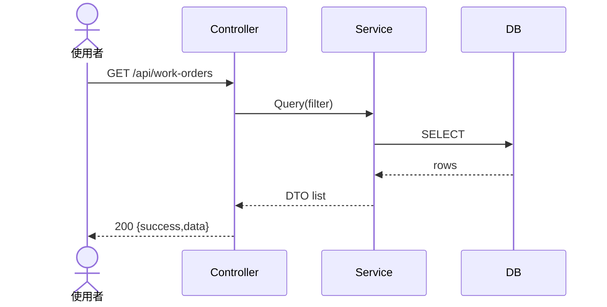
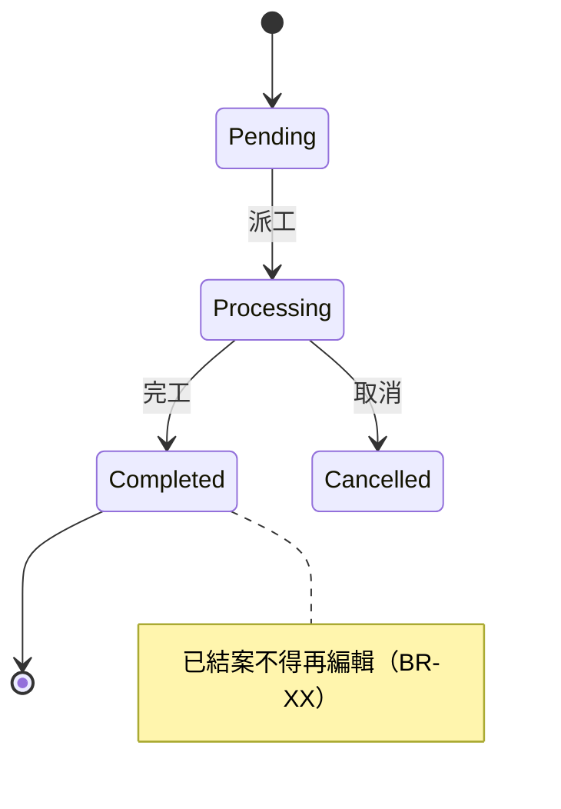
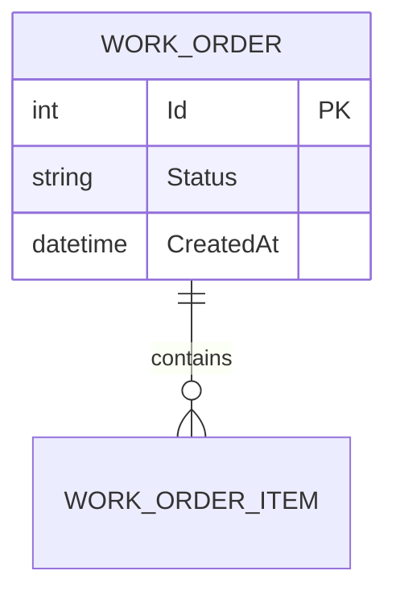
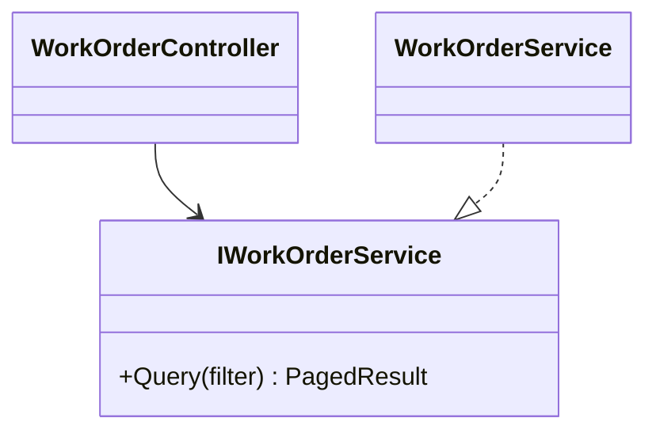
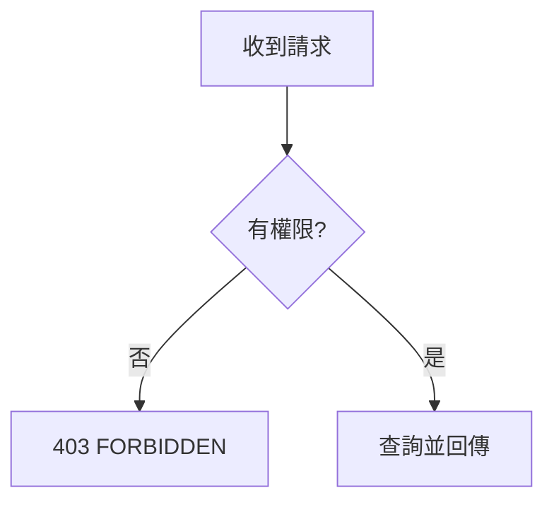

# UML / Mermaid 骨架

原則：

- **圖優先於長文字**：能用圖講清楚的，不寫長段定義。
- 一張圖講一件事、不超過一屏；太複雜就拆小圖。
- 用量：循序圖＝每個主要流程一張；狀態圖＝每個有生命週期的實體一張；ER 圖＝本次相關資料表一張；類別圖＝模組級一張（需要才畫）。
- 圖跟著程式走：段落收尾（`/milestone-loop`）時更新。**過時的圖比沒圖更糟**。

## 循序圖（主要流程）

## 狀態圖（有生命週期的實體）

## ER 圖（本次相關資料表）

## 類別圖（模組級，需要才畫）

## 流程圖（分支邏輯）

