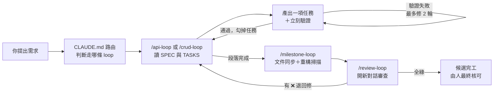

# 白話導覽：這套 Harness 每個檔案為什麼存在

> 給第一次接觸的人。這裡不列規則條文（條文在各檔案裡），只回答一個問題：**「為什麼要有這個檔？它防的是哪個坑？」**——每一項都配一個實際發生過的例子。
>
> 想直接動手的看 `USER-GUIDE.md` 的「5 分鐘上手」；這份是給想懂「為什麼」的人。

---

## 一、Harness 到底在解什麼問題

先講一個沒有 harness 的真實情境：

> 你跟 AI 說「幫我做一個裝置查詢 API」。十分鐘後它交出來的東西：多了一個你沒要求的匯出 CSV 功能、清單 API 回傳的是寫死的假資料（看起來能動，其實根本沒接資料庫）、還順手把你別的檔案「優化」了一輪。你花在**收拾**的時間，比自己寫還久。

這不是 AI 不聰明，是它有四個天生的毛病。Harness 的每個機制都對著其中一個毛病：

| AI 的毛病 | 具體長相 | Harness 的解法 |
|---|---|---|
| **愛發揮** | 沒人要求的功能它順手加、規格沒寫的它自己腦補 | SDD first：先有規格再有程式，規格沒寫的預設移除（`SPEC.md`＋鐵律 1） |
| **裝完成** | 沒做完的功能回假資料、效能數字用猜的 | 誠實原則：未實作回 501、mock 必標示、數字標 `[待實機]`（鐵律 2） |
| **會漂移** | 對話聊久了，前面立的規矩慢慢忘光 | 規則常駐（`CLAUDE.md`）＋開場自動重灌（SessionStart hook） |
| **重複踩坑** | 上週踩過的坑，這週換個對話又踩一次 | 錯誤防範庫（`LESSONS.md`）＋事件表強制回填 |

一句話總結這套 harness 的核心說法：**不是 AI 變聰明，而是 harness 讓 AI 被正確約束。**

---

## 二、一次開發會經過什麼（先看地圖再認路標）



記住三個節奏就好：

1. **平常**：一個 loop 做一項任務，做完馬上驗，驗過才算數。
2. **段落收尾**：`/milestone-loop` 讓文件跟上程式，順手掃冗餘。
3. **完工前**：**開新對話**跑 `/review-loop`（原因見第五節 Q1），全綠才能說「候選完工」——最後拍板的永遠是人。

---

## 三、資料夾地圖

```text
aspnet-api-ai-harness-v5/
├─ CLAUDE.md            ← 路由器：AI 每次對話自動讀的「總機」
├─ HARNESS.md           ← 規則總部：六條鐵律＋所有流程的原始出處
├─ USER-GUIDE.md        ← 使用手冊：5 分鐘上手＋逐檔速查表
├─ .claude/             ← 給 Claude Code 的自動化：指令、技能、開場 hook
├─ harness/             ← 每次任務的「工作檔」：規格、任務清單、狀態、踩坑紀錄、程式規範
├─ modules/             ← 需要才載入的細節規則：UI 慣例、審查規則、驗證規則
├─ templates/           ← 範本：照著填就對了，AI 不自由發揮
├─ examples/            ← 填好的完整範例：不知道怎麼填 SPEC 時抄這個
├─ prompts/             ← 沒有 Claude Code 的環境用的濃縮 prompt
├─ scripts/             ← 跑測試的統一入口
└─ docs/                ← 參考文件：簡報、工作坊流程、本檔
```

分層邏輯一句話：**HARNESS＝規則、commands＝動作、modules＝細節、docs＝參考**，每條規則只寫在一個地方，其他地方用引用的——規則抄兩份，改的時候必忘一份。

---

## 四、逐項說明（是什麼／為什麼／舉例）

### 根目錄三份

#### `CLAUDE.md`——路由器

- **是什麼**：AI 每次開對話自動讀的檔，只有 20 幾行：鐵律濃縮＋「你要做什麼 → 用哪個指令」對照表。
- **為什麼這麼短**：這個檔**每次對話都付 token**。細節放在「用到才載入」的 command 裡，常駐的只留路標。就像公司總機不需要會修機器，只需要知道轉給誰。
- **舉例**：你說「幫我加個查詢畫面」→ AI 從路由表看到「後端＋畫面 → `/crud-loop`」→ 走對流程，而不是憑感覺直接改檔案。

#### `HARNESS.md`——規則總部

- **是什麼**：六條鐵律、三種 Mode、驗證分級、模型分級、完工三關的唯一原始出處（single source）。
- **為什麼**：規則散在十個檔案裡，AI 每次讀到的版本可能不一致。集中一處，其他檔案只引用。
- **舉例**：鐵律 2「誠實原則」——AI 做不完的端點必須回 `501`，不准回一筆寫死的假資料讓你以為做完了。**假的 200 比沒做更危險**：demo 那天才發現全是假資料，就來不及了。

#### `USER-GUIDE.md`——使用手冊

- **是什麼**：5 分鐘上手＋每個檔案的一行式速查表。
- **為什麼**：新人第一份要讀的檔。本導覽講「為什麼」，它講「怎麼用」，兩份互補。

### `.claude/`——給 Claude Code 的自動化

#### 五個指令（commands/）

| 指令 | 一句話 | 防的坑 |
|---|---|---|
| `/api-loop` | 做一個後端 API 的固定流程 | 每次 prompt 品質不一——一句指令觸發同樣的完整流程，不靠當天狀態 |
| `/crud-loop` | API＋畫面一起做 | 畫面返工最貴——先審 UI Spec 再產碼；要新建超過 3 個元件先用選擇題問你 |
| `/ui-loop` | 只做畫面雛形（無後端） | 雛形不需要 API 產物；美感 AI 不可靠，一律標「待人工目視」 |
| `/milestone-loop` | 段落收尾：文件同步＋重構掃描＋清冗餘註解 | 程式迭代文件必掉隊；「過時的圖比沒圖更糟」 |
| `/review-loop` | 完工審查（必須開新對話） | 自己審自己一定放水——詳見第五節 Q1 |

- **舉例（`/api-loop` 的驗證回圈）**：AI 寫完 API 不是說「完成了」就結束——它要實際啟動服務、用 `curl.exe` 打一次真的請求、把**真實回應**貼給你看。跑不起來就老實標 blocker，不准捏造輸出。

#### 兩個技能（skills/）

- **是什麼**：`aspnet-api-crud-sdd-loop`（你忘記打指令時，AI 仍會自動判斷該走哪個 loop）、`gis-frontend`（地圖開發的專屬規則與坑）。
- **為什麼**：技能平常只佔一行描述的 token，講到相關話題才整份載入——專業領域規則「零常駐成本」。
- **舉例**：你直接說「幫我做個設備管理功能」沒打 `/crud-loop`——skill 會接住，自動照流程走，而不是讓 AI 自由發揮。

#### 開場 hook（hooks/session-start.sh＋settings.json）

- **是什麼**：每次開新對話、或長對話被壓縮後，**自動**把鐵律／路由／完工三關的摘要重新塞進對話開頭。
- **為什麼**：對話越長，AI 對開頭規則的記憶越糊——就像傳話遊戲傳到第 50 句。這叫「規則衰減」，靠 AI 自己記是記不住的，hook 是機器保證的重灌。
- **舉例**：長對話尾聲你說「順手加個欄位」。沒 hook：AI 早忘了路由表，直接動手改，跳過所有檢查。有 hook：規則剛被重灌過，AI 照樣走 `/crud-loop`。
- **要知道的一件事**：第一次在這個資料夾啟動 Claude Code，會跳出「是否信任此 hook」的詢問——按同意就好，之後不再問。

### `harness/`——每次任務的工作檔

#### `SPEC.md`——規格（一切的源頭）

- **是什麼**：本次任務的規格範本：功能需求（FR）、商業規則（BR）、測試案例（TC）都有編號；API contract、Mermaid 圖、完工標準（Done Criteria）。
- **為什麼要編號**：有編號才能對帳。審查時產「覆蓋矩陣」——每條 FR 有沒有對應的程式和測試，一眼看出；反過來也抓得出「沒有任何需求對應的程式」（那就是 AI 又發揮了）。
- **舉例**：`FR-03：Given 使用者未登入，When 呼叫查詢 API，Then 回 401`。程式和測試都標 `// FR-03`，review 時矩陣上這格就是綠的。

#### `TASKS.md`——任務清單（WBS）

- **是什麼**：規格定案後，AI 把它展開成 checkbox 清單，每條標對應 FR 和驗證方式。
- **為什麼**：「做完了沒」不能靠印象。`- [ ]` 機器可掃：審查時一行指令就知道有沒有殘留；**驗證通過才准勾**，勾了就是有證據的。
- **舉例**：`- [ ] T7 curl smoke（FR-01～03）｜驗證: L2`——這條沒勾之前，誰都不能說這功能做完了。決定不做的要經你用選擇題核可、標 `[-]`，不准默默消失。

#### `LOOP.md`——目前狀態

- **是什麼**：現在進行到哪、這輪有什麼待辦和決策。**只記待辦，不記已完成**。
- **為什麼**：記已完成的事會吃掉對話額度，還會誘導 AI 自我感覺良好。進度看 TASKS、證據看 git、這裡只放「還沒解決的事」。

#### `LESSONS.md`——踩坑紀錄

- **是什麼**：踩過的坑，固定格式「問題 → 原因 → 防範」，一行一坑。每個 loop 開工前 AI 先掃一遍。
- **為什麼**：AI 沒有跨對話的記憶，同一個坑會無限重踩——除非把防範寫成開工必讀清單。回填不靠自覺，靠**事件表 E1–E5** 逐項對照（fix 修兩輪、review 出 ❌、被人指正、驗證曾失敗、你否決過它的建議——中了就記），像餐廳關店前的檢查表，逐項勾而不是憑感覺。
- **舉例（真實條目）**：`LS-07：在 PowerShell 打 curl 參數全錯 → 因為 curl 在 PowerShell 是別名 → 防範：一律明寫 curl.exe`。記下來之後，這個坑再也沒踩過。

#### `CODE-RULES-api.md`／`CODE-RULES-ui.md`——程式規範（按面向拆兩份）

- **是什麼**：後端（分層、命名、資料表、migration）和前端（框架慣例、API 封裝）的細則，各一份。**技術棧綁定全部集中在這裡**——核心規則不綁棧，換技術棧只換這兩份＋templates。
- **為什麼拆兩份**：純後端工作不必載前端規則，省 token；也防 AI 把前端慣例套到後端。
- **舉例**：AI 預設會用它自己習慣的通用風格寫程式。有了這份，它寫出來的 Controller 分層、表命名（`work_order_m` 小蛇形）、審計欄位，跟你公司既有專案長得一樣——review 的人不用重新適應。

### `modules/`——需要才載入的細節

#### `crud-ui/` 三件（UI 慣例、Design Token 規則、Design System 摘要）

- **是什麼**：表單互動慣例（必填加 `*`、危險操作二次確認…）、樣式 token 檢查規則、公司設計系統的摘要版。
- **為什麼是「摘要」**：完整設計文件太大，每次貼會爆 token；摘要一次寫好重複用。token 規則做成「可執行的檢查」而不是「寫在文件裡等人遵守」——檢查 → 修正 → 複驗，閉環。
- **舉例**：AI 想寫 `color: #FF0000` → token 檢查攔下來 → 改成 `var(--color-danger)`。將來公司換主色，改一個變數全站生效，不用全域搜尋色碼。

#### `review/` 兩件（審查規則＋通用檢查清單）

- **是什麼**：審查的完整規則（三維度、嚴重度分級、申辯通道）＋一份不需要規格也能審的通用清單。
- **為什麼要「雙向偵測」**：AI 不只會**漏做**（缺 fallback、缺邊界處理），也會**多做**（沒人要求的抽象層、用不到的 Cache）。審查同時抓兩頭，過度設計與設計遺漏同等重要。
- **舉例（申辯通道）**：Reviewer 標 ❌「刪除沒做軟刪除」，但規格明寫硬刪除——Coder 可以拿規格條文要求重審**那一條**（限一次），不用乖乖去「修一個本來就沒錯的東西」。審查者也會看走眼，所以留了這條救濟通道。

#### `verify/`——驗證分級

- **是什麼**：L0（build）→ L1（測試）→ L2（curl 實打）→ L3（瀏覽器 E2E）的規則，永遠先跑便宜的。
- **為什麼**：各級成本差十倍以上。build 都不過就去開瀏覽器測 E2E，是燒錢燒時間。L0 不過就不跑 L1，以此類推；L3 預設跳過，要驗收才跑。
- **舉例**：E2E 測試裡外部付費 API 一律 mock——曾經有測試直接打真的 AI API，把額度燒掉（LESSONS 記過這條）。

### `templates/`、`examples/`、`prompts/`、`scripts/`

- **`templates/`**：`.http` 測試檔、TDD 案例、mock 資料、Mermaid 圖骨架、接手舊系統的盤點清單……**AI 照範本填，而不是自由發揮**——產出格式統一，review 的人每次看到的長相都一樣。
- **`examples/`**：兩個**填好的**完整範例（派工單 API、設備 CRUD）。不知道 SPEC 怎麼填？抄這個，比讀十頁說明快。
- **`prompts/`**：沒有 Claude Code 的環境（其他 AI 工具）用的濃縮 prompt，把 loop 精華壓成可貼上的幾段話。
- **`scripts/`**：跑測試的統一入口（`run-tests.ps1`／`.sh`）——L1 驗證只有一個門，不會每次用不同指令。

### `docs/`——參考文件

簡報（工作坊開場）、網頁版手冊、三堂課流程、導入 FAQ、規則演進紀錄（每條規則當初是踩了什麼坑才立的）。開發時用不到，備課和導入時用。

---

## 五、三個最常被問的「為什麼」

**Q1：為什麼審查一定要開新對話？同一個對話裡叫 AI 自己檢查不行嗎？**

不行。同一個對話裡，AI 記得自己剛才「為什麼這樣寫」，檢查時會沿著同樣的思路找**支持自己的證據**——它會驗證，不會證偽。就像自己改自己的考卷，錯的地方看十遍也看不出來。開新對話＝換一個沒有包袱的腦袋，只看程式和規格，這才是真正的第二雙眼睛。

**Q2：為什麼 AI 不能自己宣告完工？**

因為「看起來做完」和「真的做完」差很遠，而 AI 天生偏向前者。所以完工有三關：TASKS 無殘留 → 規格的 Done Criteria 逐條成立 → review 全綠。三關全過，AI 也只能說「**候選**完工」——最後拍板的是人。這不是不信任 AI，是把「說了算」的權力留在該在的地方。

**Q3：為什麼規則不全部寫進 CLAUDE.md，一次讓 AI 全知道？**

因為 CLAUDE.md 每次對話都付 token，而且**規則越長，每一條被記住的機率越低**——重點會被埋沒。所以採「路由器」設計：常駐的只有 20 行路標，細節放在「做那件事才載入」的檔案裡。省錢，而且每條規則出場時都是主角。

---

## 六、新手上路三步

1. **複製**整個資料夾到你的專案根目錄（不要挑著複製，檔案之間有相互引用）。
2. **填** `harness/SPEC.md`（照 `examples/` 抄格式），導入期補 `CODE-RULES-*` 的公司實值。
3. **開始**：`/api-loop 你的功能名`——剩下的流程 AI 會照著走，該問你的時候它會用選擇題問。

有疑問先查 `USER-GUIDE.md` 的速查表；想知道某條規則的來歷，看 `docs/case-studies.md`。
