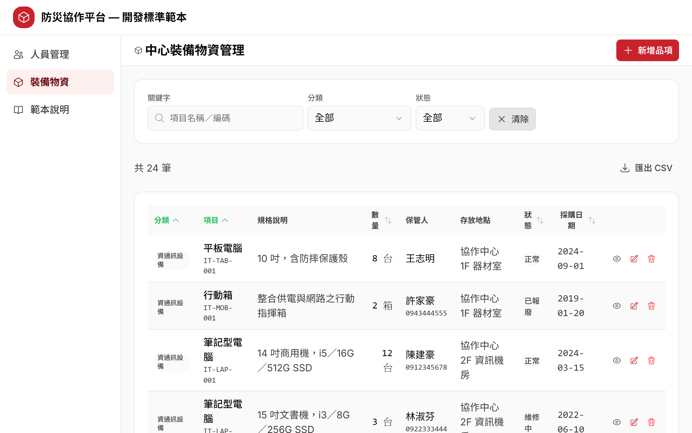
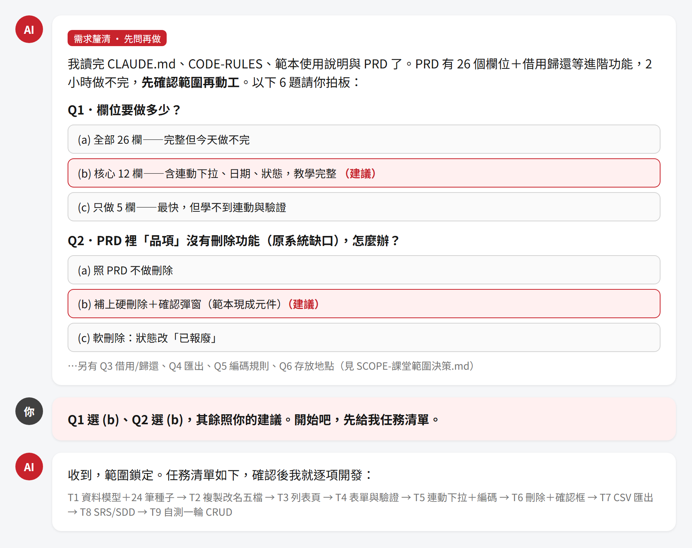
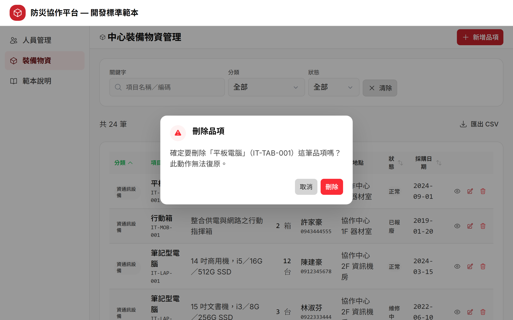

# Step 3｜複製範本開發新模組

> **這一步你不寫程式，你當的是「提需求、做決策、驗成果」的人。**

前面兩步你已經玩過範本（人員 CRUD，Nuxt 3，跑在 port 3100）、看過 harness（`CLAUDE.md`＋`CODE-RULES`）。這一步要用同一套範本＋harness，長出一個全新的模組：**中心裝備物資**。

你要做的只有三件事：讀懂需求（3.1）、把需求丟給 AI 並拍板範圍（3.2）、打開瀏覽器驗收與修正（3.3）。寫程式的粗活是 AI 的事。

---

## 3.0 準備工作區

動手之前，先把範本複製成你自己的工作專案，並確認 AI Agent 的工作目錄就是這個專案根目錄（不然 AI 讀不到題目文件與 harness）。

**Windows（PowerShell）**

```powershell
# 在工作坊根目錄執行：複製範本成你的工作專案
Copy-Item -Recurse step2_speedrun_kit\2.5_sample_app\sample-app step3_new_module\my-equipment-app
# 只把 PRD 放進專案（AI 才讀得到需求）
Copy-Item step3_new_module\PRD-中心裝備物資.md step3_new_module\my-equipment-app\
cd step3_new_module\my-equipment-app
pnpm install
# 在「這個資料夾」開 AI Agent（工作目錄＝專案根目錄）
```

**macOS／Linux（終端機）**

```bash
# 在工作坊根目錄執行：複製範本成你的工作專案
cp -R step2_speedrun_kit/2.5_sample_app/sample-app step3_new_module/my-equipment-app
# 只把 PRD 放進專案（AI 才讀得到需求）
cp step3_new_module/PRD-中心裝備物資.md step3_new_module/my-equipment-app/
cd step3_new_module/my-equipment-app
pnpm install
# 在「這個資料夾」開 AI Agent（工作目錄＝專案根目錄）
```

> 複製 `sample-app` 時如果它已經跑過 `pnpm install`，`node_modules` 會一起被複製（檔案很多、會等一下）。
> 想快一點，可以先刪掉來源的 `node_modules` 再複製，複製完在新專案跑 `pnpm install` 即可。

> **範圍答案（SCOPE）由講師在你完成六題釐清後發放，先別偷看。** 這一步的重點就是你親自跟 AI 把範圍釐清出來，答案先進工作區等於直接抄，練習就沒了。

> `sample-app` 根目錄已自帶 harness 四件（`CLAUDE.md`、`CODE-RULES-ui-本專案.md`、`design-system-summary.md`、`使用說明-複製範本開發新模組.md`）。複製走範本，harness 就跟著走——AI 一進來就讀得到全套規則。

---

## 3.1 讀 PRD

打開 [`PRD-中心裝備物資.md`](PRD-中心裝備物資.md)，先讀懂「這個模組原本長什麼樣」。

### PRD 哪裡來？

這份 PRD 不是憑空寫的，是從**真實災防平台的現有頁面逆向整理**出來的——把原始碼一行一行讀回來，還原成需求規格。所以它記的是「現況」，不是「理想」。

### 讀 PRD 時要注意什麼

| 注意點 | 說明 |
|---|---|
| **它忠實記錄現況，連缺口都記著** | 例如 PRD 第 2.4 節白紙黑字寫「品項**沒有**刪除功能」。真實系統就是漏了，PRD 不幫它補、也不假裝有——缺口原樣保留。 |
| **標「原始碼未見／TODO」的地方＝待決策** | 匯出是 TODO 空實作、匯入解析是 TODO、進階細部篩選有邏輯沒 UI。這些不是 bug，是留給你決定「這堂課做不做」。 |
| **26 個欄位＋借用歸還＋維保提醒，兩小時做不完** | 這很正常。PRD 是完整現況，課堂要的是「小而完整」——所以下一步要先裁範圍。 |

> **心法：PRD 給你「全貌」，不是「這堂課的範圍」。** 看到做不完不要慌，那正是 3.2 要解決的事。

---

## 3.2 把需求丟給 AI，讓它先問問題

你不會叫 AI「照 PRD 做」就走開——那會得到一個做不完、也不適合教學的東西。正確流程是**先釐清、再動工**：

### 生成流程圖

```
你：貼【起手 prompt】（PROMPTS.md 有現成的，直接複製）
        │
        ▼
AI：依序讀 CLAUDE.md → CODE-RULES → 使用說明 → PRD
        │
        ▼
AI：先不寫程式，改用「選擇題」問你範圍釐清問題（每題 2-4 選項＋建議選項）
        │
        ▼
你：一題一題拍板（可直接採納建議選項）
        │
        ▼
AI：輸出「任務清單」（8-10 個任務），停下來等你確認
        │
        ▼
你：確認開工
        │
        ▼
AI：逐任務開發，遵守 harness 規則，每完成一個任務回報一行
        │
        ▼
（產出：SRS、SDD、前端程式、mock 資料）
```

用一句話記：**貼 prompt → AI 問 → 你答 → AI 列任務 → 你確認 → AI 逐項做並回報。**

### 為什麼要讓 AI 先問問題？

因為 PRD 有太多「做不做都行」的岔路。AI 先用選擇題把岔路攤開來，你拍板，範圍才會小而完整。這跟 spec-kit 的 clarify 是同一個道理：**先問對問題，再寫對程式。**

> **別把「AI 有先問選擇題」當成 harness 的效果。** AI 先問選擇題＝起手 prompt 的 workflow 指令被遵守（我們在 prompt 裡明寫「先用選擇題問我」）。harness（規則＋範本）的效果體現在**生成的程式碼品質**——色碼走 token、命名一致、驗證到位、不硬編碼——對比 step1 的 A/B 就看得到。兩者是不同層次的東西，別混為一談。

實際會問哪些題？完整六題與參考答案見 [`SCOPE-課堂範圍決策.md`（講師版）](../instructor/SCOPE-課堂範圍決策.md)（講師在你答完六題後才發放），這裡摘要：

| # | AI 會問 | 課堂拍板 |
|---|---|---|
| Q1 | 欄位做多少？ | 核心 **12 欄**（不是全部 26 欄） |
| Q2 | PRD 沒有刪除功能，怎麼辦？ | **補上硬刪除＋確認彈窗**（CRUD 教學要有 D） |
| Q3 | 借用／歸還、維保、照片、匯入 Excel？ | **全部範圍外**（不是 CRUD 骨架） |
| Q4 | 匯出？ | **CSV 匯出**（範本現成工具，成本趨近零） |
| Q5 | 編碼規則？ | **簡化版**（不含機關前綴、不做同碼累加數量） |
| Q6 | 存放地點？ | **單一文字欄位**（不做級聯地址） |

> 這六題不用背。重點是理解：**每一題都是在「完整 PRD」和「兩小時課堂」之間做取捨**，而做取捨的人是你，不是 AI。

如果 AI 沒問就直接開始寫程式，別讓它跑——救援 prompt 見 [`PROMPTS.md`](PROMPTS.md) 的【釐清階段】。

---

## 3.3 察看與修正

AI 逐任務做完後，換你上場驗收。

### 驗收方式

1. 確認 dev server 有跑（port 3100）。
2. 打開 <http://localhost:3100/equipment/crud>。
3. 拿 [`SCOPE-課堂範圍決策.md`（講師版）](../instructor/SCOPE-課堂範圍決策.md) 的欄位規格與列表功能表逐項對照。

**至少要能重現這幾件事：**

| 驗收點 | 期望 |
|---|---|
| 列表 | 桌機表格、預設每頁 20 筆、預設「分類→項目」升冪、顯示總筆數 |
| 連動下拉 | 先選「分類」→「項目」才可選，且只出現該分類的項目 |
| 關鍵字搜尋 | 打品名或編碼片段能過濾（不分大小寫、部分比對） |
| 新增 | 選定分類＋項目後標題即時顯示自動編碼；必填未填時可按儲存，但會在欄位下方顯示紅字錯誤並聚焦第一個錯誤欄位、toast 顯示「請修正 N 個欄位」 |
| 編輯 | 預帶原值，改完儲存生效；取消不變更 |
| 刪除 | 垃圾桶 → 二次確認彈窗 → 才刪掉 |
| 狀態標籤 | 正常＝綠、維修中＝黃、已報廢＝紅 |
| CSV 匯出 | 匯出全量（非當頁），含 BOM 中文不亂碼 |

### 修正心法（三條）

| 心法 | 怎麼做 | 為什麼 |
|---|---|---|
| **一次只修一個問題** | 一則訊息只提一件事，改完再看下一件 | 一次丟五個問題，AI 顧此失彼，你也分不清哪個改動造成哪個結果 |
| **描述「看到什麼 vs 期望什麼」** | 「我在列表看到日期是 2026/7/1，期望顯示成 2026-07-01」 | 給 AI 具體落差，它才知道要改哪、改成什麼；只說「不對」它只能猜 |
| **兩次修不好就重新描述** | 換個說法把問題重講一次，別繼續在同一串盧 | 同一句反覆盧，AI 會越改越歪；重新描述等於給它一個乾淨的起點 |

修正 prompt 的現成句型見 [`PROMPTS.md`](PROMPTS.md) 的【修正 prompt 範本】。

---

## 產出物清單

AI 跑完這一輪，會交出四類東西：

| 產出 | 是什麼 | 你要看什麼 |
|---|---|---|
| **SRS**（需求規格） | 把拍板後的範圍寫成正式需求 | 對照你的決策有沒有漏、有沒有多 |
| **SDD**（設計規格） | 資料模型、元件拆法、待辦（如「正式版建議改軟刪除」） | 確認技術決策合理、待辦有記 |
| **程式碼（8 檔）** | 複製改名 5 檔＋直接共用 3 檔 | 對照下表，看該複製的有複製、該共用的沒亂動 |
| **mock 資料** | 24 筆種子，涵蓋 10 分類、三種狀態 | 資料齊不齊、狀態全不全 |

### 程式碼 8 檔對照（詳見 SCOPE 的「改名對照」表）

| 範本檔 | 新模組檔 | 處置 |
|---|---|---|
| `pages/template/crud/index.vue` | `pages/equipment/crud/index.vue` | 複製改名 |
| `pages/template/crud/[id].vue` | `pages/equipment/crud/[id].vue` | 複製改名 |
| `composables/useTemplateMembers.ts` | `composables/useEquipmentItems.ts` | 複製改名 |
| `components/template/TemplateFormField.vue` | `components/equipment/EquipmentFormField.vue` | 複製改名 |
| `components/template/TemplateStatusBadge.vue` | `components/equipment/EquipmentStatusBadge.vue` | 複製改名 |
| `composables/useTemplateListPage.ts` | —（直接共用） | 不動 |
| `utils/templateValidation.ts` | —（直接共用） | 不動 |
| `utils/templateCsv.ts` | —（直接共用） | 不動 |

**判斷準則：跟實體長相有關的→複製改名；通用機制→直接共用。**

### 關於 mock 資料

這 24 筆假資料不只是「先有東西看」而已——**mock 的欄位名，就是未來接後端 API 的 interface。** 現在欄位名怎麼定，將來後端就照這份對接（`qty`、`unit`、`keeper`、`status`…），欄位名之後不再改。所以驗收時也順手看一眼欄位命名合不合理。

---

## 卡住怎麼辦？

`solution-app/` 放了參考解。**先自己做，真的卡住兩次以上再去看**——直接抄答案學不到「怎麼跟 AI 提需求、怎麼驗收」，那才是這堂課的重點。

---

## 截圖參考






