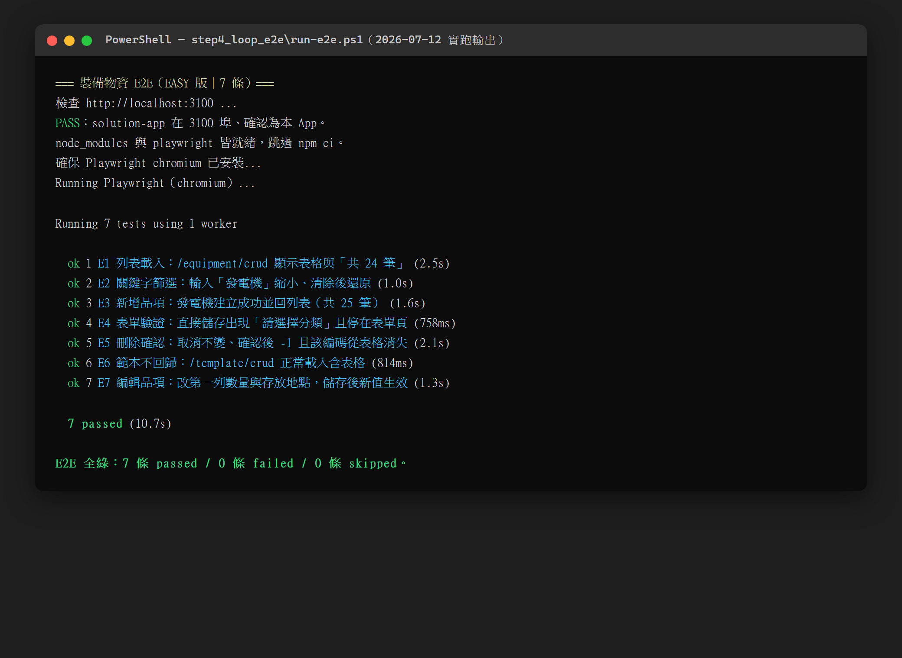

# Step 4｜LOOP 工程 × E2E 驗證

這一步做兩件事：**建一套會自己跑到綠的 E2E 測試**，並用它示範什麼叫 **LOOP 工程**——
讓 AI 自己跑「改 → 驗證 → 再改」直到綠，人只看結果。

---

## 一、LOOP 工程是什麼

一句話：**先給 AI 一個「可自動執行、會給出綠/紅」的驗證，再叫它自己修到綠。**

| 沒有 LOOP（人在迴圈裡） | 有 LOOP（AI 在迴圈裡） |
|--------------------------|--------------------------|
| AI 改一版 → 人手動開瀏覽器點一點 → 回報哪裡壞 → AI 再改 | AI 改一版 → 自己跑 `run-e2e.ps1` → 看到紅 → 自己修 → 再跑 → 綠了才停 |
| 人是瓶頸，改 5 次就累了 | 人只看最後結果，AI 跑幾輪都不喊累 |

**關鍵前提：要先有「可自動執行的驗證」。** 沒有這個，LOOP 就退化成 AI 自說自話。
E2E（端到端測試）就是這裡的驗證——它真的開瀏覽器、真的點按鈕、真的斷言畫面，紅綠不騙人。

> **學習目標升級**：這一步的重點**不是「跑一次看到 7 條全綠」**——那只證明現在沒壞。
> LOOP 的精髓是**經歷一整圈「紅 → 判因 → 修 → 綠」**。所以本步驟附了一個可還原的刻意失敗練習
> （見下方**第七節「動手練習」**，練習包在 [`lab-red-to-green/`](./lab-red-to-green/)），請務必親手跑過那一圈，別只看綠。

---

## 二、怎麼下 LOOP prompt

驗證備妥後，一段話就能啟動 LOOP。可直接貼：

```
跑 step4_loop_e2e/run-e2e.ps1。
若有紅字，找出原因、修正後再跑一次，直到 7 條全綠。
規則：同一個問題連續修兩次還沒好就停下來回報（不要無限撞牆）。
只准修測試，不准為了過測試去改 solution-app 的程式；
若判斷是 App 真的有 bug，記下來回報，但不要動 App。
```

重點兩條：

1. **停損規則（修兩次沒好就停）**：避免 AI 在同一個坑裡鬼打牆、愈修愈亂。兩次修不好＝方向錯了，該讓人看。
2. **修測試不修 App**：LOOP 很會「為了讓燈變綠」而作弊（例如放寬斷言、改壞 App 邏輯）。用這條把它框住。

---

## 三、E2E 功能驗證＋失敗截圖診斷：截圖不只給人看，也給 AI 看

先講清楚這 7 條測試「是什麼、不是什麼」，別把名稱喊得比覆蓋還大：

- **是**：**功能驗證**——真的開瀏覽器、真的點按鈕、真的斷言 CRUD／篩選／驗證的行為對不對，紅綠不騙人。
- **不是**：**視覺回歸**（pixel 比對 baseline）。這 7 條沒有 `toHaveScreenshot` baseline，也只跑桌機。

Playwright 設 `screenshot: 'only-on-failure'`——測試紅了會自動存一張當下畫面的截圖。這是**失敗診斷**，不是視覺回歸。

這張截圖有兩個用途：

- **給人看**：一眼看出是「按鈕點不到」還是「畫面根本沒載出來」。
- **給 AI 看**：AI 看得懂截圖。把失敗截圖貼回對話，AI 能直接從畫面判斷 selector 該怎麼改，比純文字錯誤訊息快。

本教材附的這張 E2E 畫面，就是這樣用 Playwright 截下來、可直接貼回給 AI 判讀的：



### 那「真正的視覺審查」是什麼？

真正的視覺審查是**人（或另一個 AI）逐張把截圖看過去**，判斷「這畫面長得對不對、像不像同一個系統」。
本教材 HANDBOOK 裡的 16 張截圖，就是這樣一張一張**人工審過**的——這才是這門課實際做過的視覺審查，不是靠自動化跑出來的。

### 這 7 條沒涵蓋、可自行「進階可加」的驗證（本教材不實作）

想把驗證做得更完整，這些是明確的下一步（列清單、不動手）：

- **手機視圖**：加一個 390px 寬的 mobile project，驗卡片式版面與手機 CRUD。
- **CSV 匯出**：驗匯出檔內容（RFC 4180＋UTF-8 BOM、匯出的是篩選＋排序後全量）。
- **URL 同步／排序／分頁**：驗篩選寫進網址、重新整理狀態還在，點表頭排序、換頁行為正確。
- **視覺回歸 baseline**：加 `toHaveScreenshot` 比對 baseline，才算真正的「視覺」自動化。
- **最小 a11y**：關鍵欄位有 label、錯誤訊息可被讀屏抓到。

---

## 四、對抗審查：別讓寫程式的 AI 自己審自己

**寫這套測試的 AI，不適合當它自己的審查者**——它會傾向相信自己寫對了。
正確做法：**換第二個 AI（例如本機 Codex），用「盡力推翻它」的立場審。**

可直接貼給第二個 AI 的對抗審查 prompt：

```
你的任務是「盡力推翻」這套 E2E，不是誇獎它。用懷疑的眼光找出以下問題：
1. 有沒有「假綠」——測試看似過了，其實根本沒驗到重點（斷言太鬆、選到隱藏節點、
   等到的是別的元素）？
2. selector 是不是猜的？有沒有靠位置索引（nth）這種一改版面就碎的寫法？
3. 7 條測試會不會互相污染（前一條的資料影響後一條）？
4. 有沒有為了讓燈變綠而偷改了 App 行為，或放寬了本該嚴格的斷言？
逐條給出「可被推翻的具體理由」，能重現就附步驟。找不到問題也要說明你怎麼確認的。
```

第二個 AI 挑出的問題，交回原 AI 修 → 再跑 `run-e2e.ps1` → 再審。這就是「對抗式 LOOP」。

---

## 五、七條測試清單

每條只驗一個觀念，對應一個 CRUD 面向（EASY 版刻意精簡，好懂好教）。

| 編號 | 驗什麼 | 對應 CRUD 觀念 |
|------|--------|----------------|
| E1 | 進 `/equipment/crud` 看得到表格、筆數「共 24 筆」 | **Read**（讀取／列表載入） |
| E2 | 輸入「發電機」列表縮到 2 筆且含發電機；再用編碼「PW-GEN」也命中 2 筆；清除後恢復 24 筆 | **Filter**（關鍵字過濾，名稱＋編碼） |
| E3 | new → 選分類「供電及照明設備」→ 選項目「發電機」→ 看到編碼自動預覽 `PW-GEN-003` → 填數量/單位/規格 → 儲存 → 回列表共 25 筆、搜得到新的一筆 | **Create**（新增，含分類→項目連動、編碼自動產生） |
| E4 | new 直接按儲存 → 出現「請選擇分類」錯誤且停在表單頁 | **Validation**（欄位級驗證，錯誤不離頁） |
| E5 | 記下第一列編碼 → 刪除 → 「刪除品項」確認框 → 取消筆數不變 → 再刪按「刪除」筆數 -1 且該編碼從表格消失 | **Delete**（二次確認：取消不動、確認才刪） |
| E6 | `/template/crud` 正常載入含表格 | **Regression**（新模組沒改壞被複製的人員 CRUD 範本） |
| E7 | 第一列進編輯（`?mode=edit`）→ 改數量與存放地點 → 儲存 → 回列表用編碼查回該筆，斷言新值已生效 | **Update**（編輯既有品項，儲存後可查得新值） |

---

## 六、怎麼跑

先確認 solution-app 在跑（另一個視窗，別關）：

```
cd ../step3_new_module/solution-app
pnpm dev          # http://localhost:3100
```

再跑 E2E：

```
cd step4_loop_e2e
powershell -ExecutionPolicy Bypass -File .\run-e2e.ps1
```

`run-e2e.ps1` 會：先確認 3100 有回應且是本 App → e2e 資料夾裝相依（已裝就跳過）→
跑 7 條測試 → 印 PASS/FAIL 總結，exit code 對應（0＝全綠、1＝有紅）。

---

## 七、動手練習：紅 → 判因 → 修 → 綠（LOOP 的完整一圈）

看到綠只是起點。真正要學會的是**當測試變紅時，你怎麼判斷、怎麼修**。
這裡準備了一個**可一鍵注入、可一鍵還原**的刻意失敗練習，讓你親手經歷一整圈。

➡️ 練習包在 [`lab-red-to-green/`](./lab-red-to-green/)，完整步驟看它的 [`README.md`](./lab-red-to-green/README.md)。

一句話流程：**基準綠 → 注入 bug → 看到 E4 紅 → 判因（App bug 還是測試 bug？）→ 修 → 回到綠**，
過程留下四項證據（紅輸出、根因一句話、修正方式、綠輸出）。進階再自己加第 8 條測試。

---

## 八、測試資料是「記憶體 mock」，reload 就重置

E3 新增了第 25 筆，但資料層是**記憶體 mock**，每次整頁載入都重置回 24 筆種子。
所以每條測試各自 `goto` 進頁時都是乾淨的 24 筆，**測試之間不會互相污染，不用手動清資料**。
（等接了真的後端資料庫，這件事要改用「測試前後清資料／交易回滾／獨立測試庫」處理，不能再靠 reload。）

---

## 九、這門課真實的 LOOP 紀錄

想看我們**建這套測試時一輪一輪怎麼跑、怎麼探路、怎麼跑到綠**的真實過程，看隔壁：

➡️ [`EVIDENCE-建置實錄.md`](./EVIDENCE-建置實錄.md)

那份就是我們建這門課時真實的 LOOP 紀錄——包含「先 probe 抓 DOM 再寫 selector」這個關鍵紀律，
以及為什麼這樣做能讓正式測試第一次跑就全綠。
